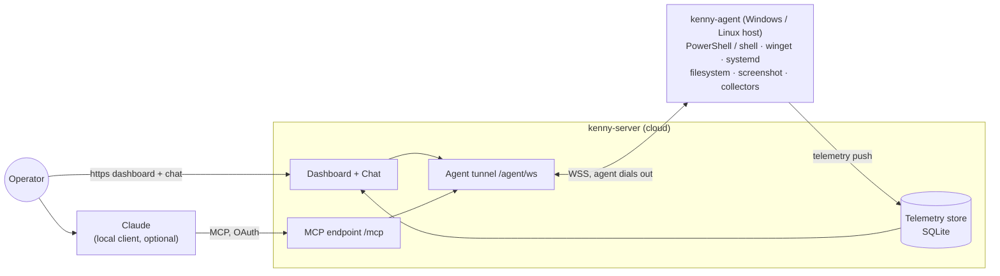

<div align="center">


# 🐕 kenny

**Self-hosted remote administration _and fleet monitoring_ for Windows and Linux, driven by Claude (MCP) and a web dashboard.**

[](LICENSE)
[](https://github.com/nullthrone/kenny/actions/workflows/ci.yml)
[](https://nullthrone.github.io/kenny/)
[](https://github.com/nullthrone/kenny/releases)

</div>

kenny administers a small fleet of Windows and Linux machines from one place: pushed telemetry
with server-side health rules and alerting, capability tools that act on a host, account
governance, a web filter and screen time, and a ticket queue the people who use those machines
can open themselves. Operate it through Claude over MCP, through the built-in chat, or by hand
in the console. It is for the machines **you** administer, with the consent of the people who
use them — family PCs, a home lab, a small office.



- **kenny-server** (Python / FastMCP): stable MCP endpoint for Claude, the agent tunnel,
  the telemetry store (SQLite), and the operator dashboard. One ASGI app, one port.
- **kenny-agent** (Rust, single binary): runs on each managed host — Windows or Linux —
  dials **out** to the server (NAT/firewall friendly), executes tool calls in the user's
  session, and pushes periodic health snapshots.

## ✨ Features

### Fleet monitoring
- **Push telemetry** from each PC (default every 15 min, plus an immediate first push),
  persisted in SQLite with ~30-day retention and a per-agent history.
- **~30 telemetry sections**: disk + SMART, memory, processes, CPU/thermals, uptime,
  network + routing, Wi‑Fi quality, Defender (+ quarantine), third-party AV, firewall,
  BitLocker encryption, Windows Update + app updates, reboot-pending, OS support/EOL,
  services, autostart, scheduled tasks, peripherals, printers, local accounts, listening
  ports, backup status, battery, reliability, time sync, **web activity**, **screen time**.
- **Server-side health rules** (authoritative): e.g. disk > 80 % ⇒ warn / ≥ 95 % ⇒ crit,
  Defender real-time off ⇒ crit, with worst-of roll-up per agent and across the fleet.
- **Push alerting** on health transitions (ntfy / webhook), a **weekly digest**, and
  server-side **diff + forecast** (inventory changes, disk-fill and battery forecasts).

### Operator dashboard (web UI)
Five destinations: **Today** (a landing page with one verdict sentence and at most three
  items ranked by consequence), **Fleet** (card grid with per-host drill-down to full
  telemetry detail, health trend, changes & forecast, and the last screenshot), **Inbox**
  (approvals, flagged sections, and tickets in one queue), **Log** (filtered stream of tool
  calls, alerts, and events), and **Admin** (settings, users, updates). **Ask kenny** is a
  global overlay (⌘K) with server-hosted Claude chat, saved history, and a confirm-gate on
  state-changing tools. Parental controls include web-activity monitoring, per-host web
  filter, and screen time. Action buttons: refresh, **remote help** (Quick Assist), reinstall,
  re-share, update agent; onboard a new PC from **Add a PC** (installer / share link).
  Single-page, dependency-light; dark & light themes; cookie login at `/login`.

<div align="center">


_The Today dashboard — see the **[dashboard reference](docs/dashboard.md)** for the full tour._

</div>

### Remote administration — capability tools
- **Shell**: `powershell_exec` (Windows) · `shell_exec` (Linux/macOS)
- **Packages**: `winget_list` · `winget_install` · `winget_uninstall` · `winget_update`
- **Files**: `fs_list` · `fs_search` · `fs_read` · `fs_disk_usage`
- **Diagnostics**: `diag_processes` · `diag_services` · `diag_eventlog` · `diag_autostart`
- **Network**: `net_config` · `net_dns_flush` · `net_adapter_reset`
- **Screen**: `screen_capture` · **Remote help**: `remotehelp_status` · `remotehelp_start` ·
  `remotehelp_stop` (Quick Assist concierge) · **Telemetry**: `telemetry_collect` ·
  **Agent mgmt**: `agent_update`
- **Parental controls**: `webfilter_status` · `webfilter_apply` · `webfilter_clear` (+ server-only
  `webfilter_get` · `webfilter_set` · `webfilter_push` · `web_activity_query`)
- **Server-only orchestration**: `list_agents` · `select_agent` · `fleet_overview` ·
  `agent_health` · `agent_snapshot`
- **Linux hosts are a first-class target** (ADR-0031/0034): static musl binary (x86_64 and
  aarch64), a one-line install script, a systemd service, and server-triggered self-update.
  Windows-only tools (`winget_*`, Defender, BitLocker) answer `unsupported` there, and the
  server refuses a wrong-OS call before it reaches the wire.

### Family self-service via Discord (simplified ITSM)
- An optional **Discord bot** (its own application — no shared/hosted bot exists): a family
  member `@mentions` it and kenny opens a private thread that behaves as a **ticket**,
  diagnosing on that person's own PC and keeping a paraphrased record you read in the new
  **Tickets tab**.
- **Three tool tiers**, not two: read-only runs, curated `standard_change` steps (flush DNS,
  open remote help) run **autonomously** with a trail row, everything else holds for your
  **operator approval** — while the dashboard chat still confirms both change tiers exactly
  as before. Privacy-sensitive tools (screen, files, browsing history) additionally need the
  **affected person's own consent**, a separate axis from authorization.
- A Discord account only ever reaches the PCs you assign it, via an explicit enrollment
  mapping (self-service `/link` + your confirmation, or you pick them from the guild
  member list directly) and an optional per-account **capability profile** that narrows
  which tools it may use. An alert can open a ticket too. See
  **[Tickets & the Discord bot](docs/itsm.md)**.

### Two ways to drive it with Claude
- **Local MCP client** → `/mcp` (FastMCP Streamable HTTP), connected via the built-in **OAuth 2.1**
  flow (add-custom-connector → sign in → consent); a per-user access token works for clients that
  can't do OAuth.
- **Server-hosted chat** in the dashboard (no local client): a Claude tool-use loop bridged to the
  same tools, with prompt-cached system + tool schemas; model configurable (default
  `claude-sonnet-4-6`).
- **Confirm-gate**: read-only tools auto-run; state-changing tools (`powershell_exec`/
  `shell_exec`, `winget` writes, `net_dns_flush`/`adapter_reset`, `remotehelp_start`/`_stop`,
  `agent_update`) require explicit operator confirmation.

### Agent distribution & lifecycle
- **One-click installer download** from the GUI: a prebuilt binary + a generated `install.bat`
  carrying the server URL, agent id, and a freshly minted token.
- **Expiring, one-time shareable link** (`/d/…`) for the target user — no operator login needed.
- **Windows service**: self-install (`install` / `uninstall` / `run-service`) via the
  `windows-service` crate, auto-start with restart-on-failure recovery.
- **Server-triggered self-update** (`agent_update`): download → SHA‑256 verify → staged swap with
  rollback → service restart; the agent reconnects on the new version.

### Transport & connectivity
- Agent **dials out** over WSS (NAT/firewall friendly) and never listens.
- **Frozen, versioned JSON wire contract** (`PROTOCOL_VERSION 0.10`) with golden fixtures
  round-tripped by both sides; request/response correlation, ping/pong heartbeat, and
  exponential-backoff reconnect.

### Security & auth
- **Accounts, roles & host scope** (superuser / operator / user); cookie login with the `Secure`
  flag under TLS, optional TOTP 2FA.
- **OAuth 2.1 for the MCP connector** — kenny is its own authorization server (RFC 9728 / 8414 /
  7591, PKCE, RFC 8707 audience binding); Claude Desktop connects with sign-in + consent. Per-user
  bearer tokens (PATs) and a legacy shared operator token remain accepted.
- **Per-agent tokens** in a SQLite token store with a **rotation endpoint**; the agent authenticates
  on `register`, and (from v0.8) with **mutual Ed25519** identities — the agent pins the server's
  public key and signs its handshake, enrolled one-time at install (rotation grace windows for both).
- A **shared policy catalog** + operator deny rules the server mirrors and the agent enforces.
- A **local kill-switch** (tray) and a deterministic, always-on **agent-side safety guard** that
  refuses individually dangerous calls regardless of operator approval.
- TLS server identity (`wss`), confirm-gate for destructive actions, and a tool-call audit log.

### Engineering
- **Contract-first** (`docs/protocol.md` + `docs/fixtures/`), **ADRs** (MADR) for every significant
  decision, and Claude Code **skills/commands + subagents** for repeatable changes.

## 📚 Documentation

The full docs site: **<https://nullthrone.github.io/kenny/>** (built from `docs/` with MkDocs Material).

- **[User guide](docs/user-guide.md)** — operator workflows: dashboard, chat, running tools,
  adding/updating agents (with diagrams).
- **[Dashboard reference](docs/dashboard.md)** — every tab, widget, menu, and popup in the fleet
  console, with screenshots.
- **[Telemetry reference](docs/telemetry.md)** — every section and its server-side health rule.
- **[Tool reference](docs/tools.md)** — the capability & orchestration tools, and the confirm-gate.
- **[Parental controls](docs/parental-controls.md)** · **[Alerting & digests](docs/alerting.md)**.
- **[Setup & operations](docs/setup.md)** — hosting, environment variables, TLS, building &
  distributing the agent, releases.
- **[Wire protocol](docs/protocol.md)** + **[fixtures](docs/fixtures)** — the agent⇄server contract
  (single source of truth; both sides round-trip the fixtures so they cannot drift).
- **[Architecture decisions](docs/adr)** — MADR records for every significant decision.

## 🚀 Quickstart

```bash
# Server (Docker Compose): dashboard, MCP endpoint, agent tunnel on one port
cp .env.example .env   # set KENNY_OPERATOR_TOKEN etc. (see docs/setup.md)
docker compose up -d
```

Then open the dashboard, use **Add a PC** to download an installer for each Windows machine. Full
details — TLS, environment variables, building the agent — are in **[docs/setup.md](docs/setup.md)**.

## 🛠️ Develop

```bash
# server
cd kenny-server && pip install -e ".[dev]" && pytest

# agent (builds on Linux too, via cfg fallbacks)
cd kenny-agent && cargo test && cargo build
```

Helper commands inside Claude Code: `/new-adr`, `/add-tool`, `/add-collector`,
`/contract-check`, `/e2e`, `/security-review`. See **[CONTRIBUTING.md](CONTRIBUTING.md)**.

## 🤝 Community & contributing

- **[Contributing guide](CONTRIBUTING.md)** — build/test, the contract-first workflow, and how to
  add a tool or a telemetry collector.
- **[Code of Conduct](CODE_OF_CONDUCT.md)** — Contributor Covenant.
- **[Security policy](SECURITY.md)** — please report vulnerabilities **privately**, never in a
  public issue (kenny is a remote-admin tool).
- Questions and ideas: **[GitHub Discussions](https://github.com/nullthrone/kenny/discussions)**.

## 📄 License

kenny is licensed under the **GNU Affero General Public License v3.0** ([AGPL-3.0-only](LICENSE)).
Because the server is network-facing, the AGPL's §13 means anyone who runs a modified kenny as a
service must offer its source to users.

## Status

Both components are implemented against the contract: capability tools, telemetry collectors +
health rules, the fleet dashboard, a server-hosted Claude chat (with a confirm-gate for
state-changing tools), operator + agent auth (token store with rotation), the Windows service +
server-triggered self-update, agent installer download, Docker/Compose, and a GHCR release
workflow. Runtime-only Windows behaviors (service control, live self-update swap, Quick Assist)
are compile-verified via cross-build and the Windows CI job; real-hardware verification, TLS
hardening, and code-signing are operational follow-ups (see `docs/adr/`).
