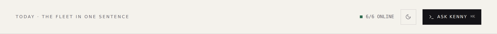
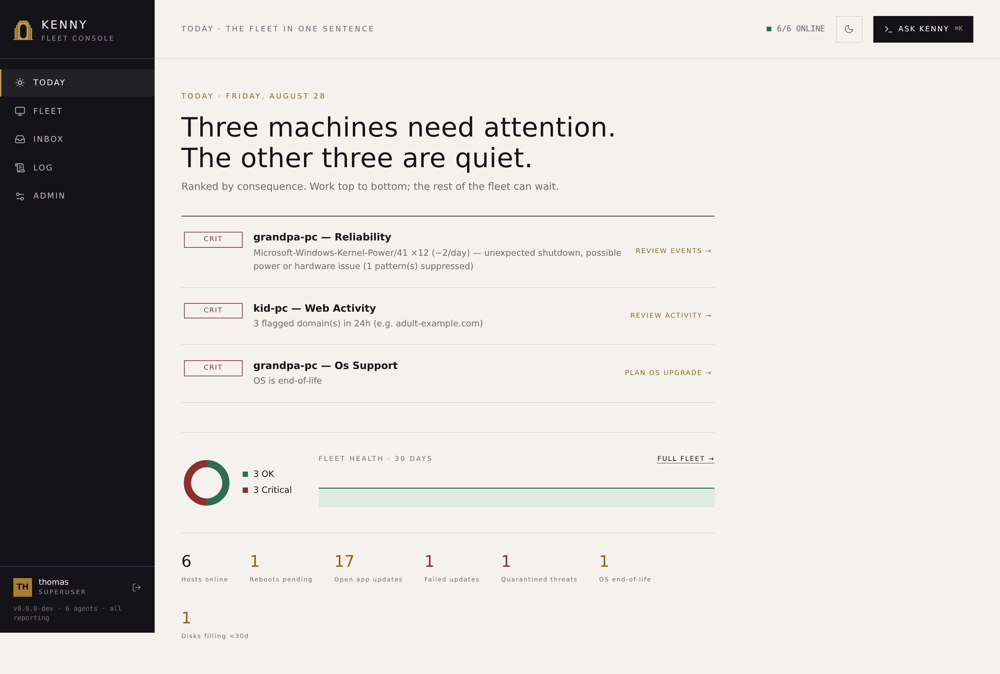
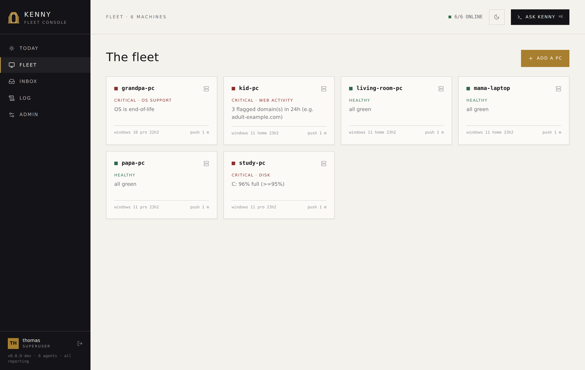
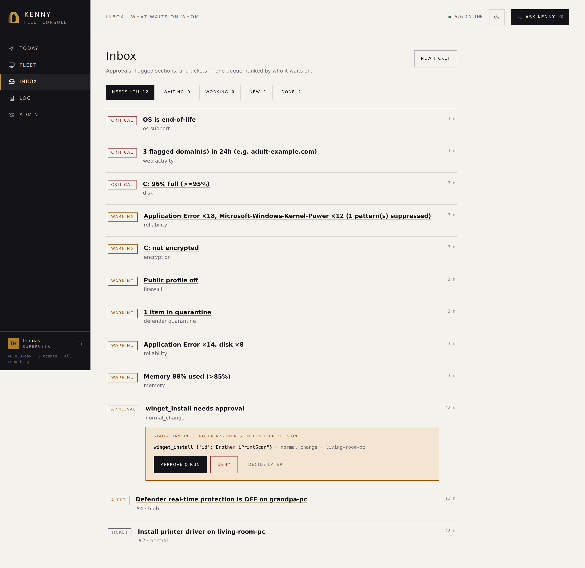
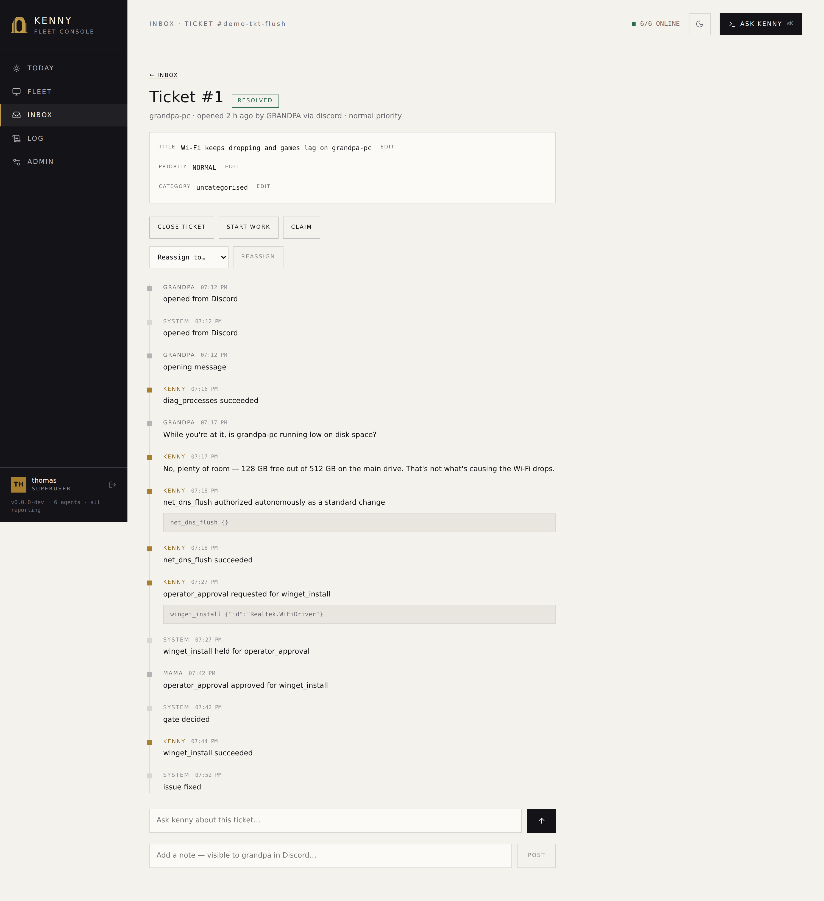
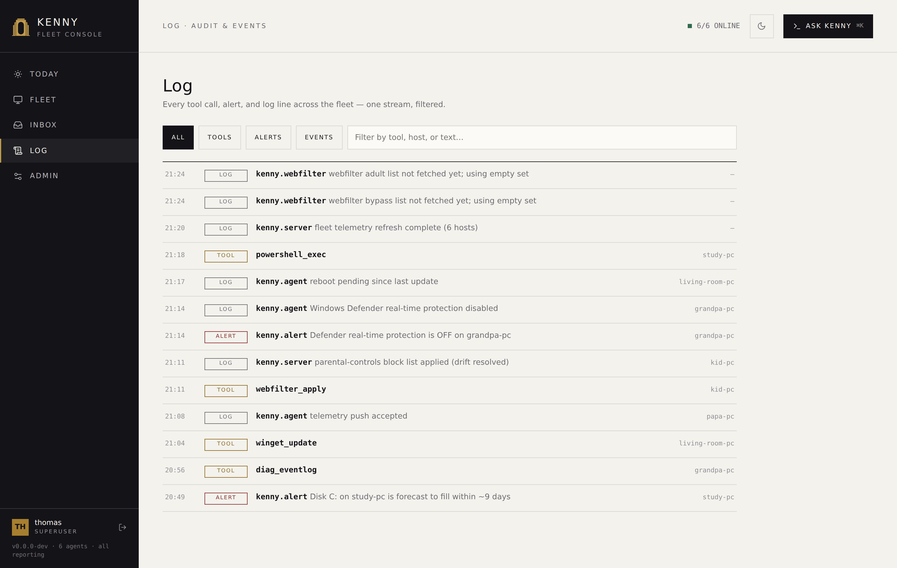
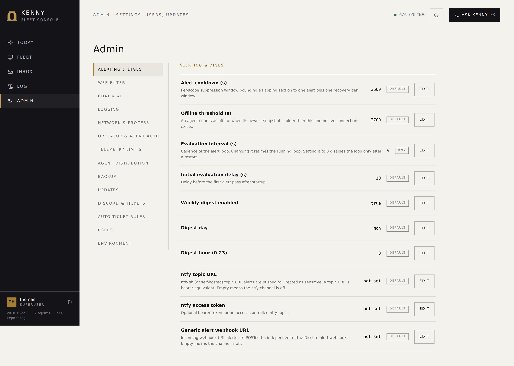
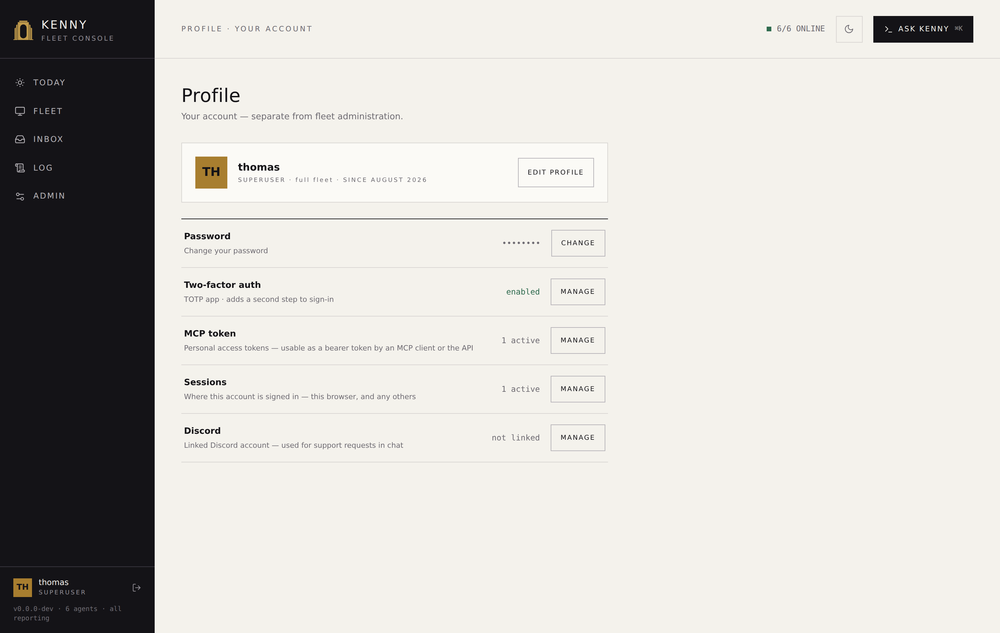
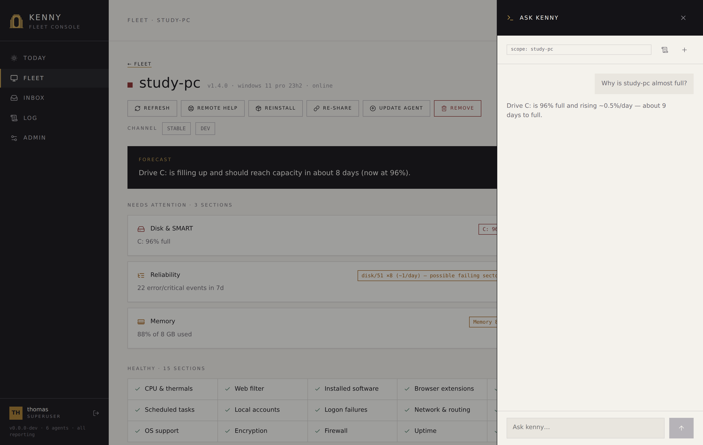

# The dashboard, view by view

The kenny dashboard is a single-page web app served by the server at `/`. It works in
light and dark themes and is driven by the login session you get at `/login` (multi-user
accounts, roles, and per-user host scope — see [Accounts & roles](#accounts-roles-the-user-menu)).

This page is the exhaustive tour: every destination, panel, menu, popup, and interaction.
If you just want the common workflows, start with the **[User guide](user-guide.md)**;
come back here when you want to know what a particular control does.

!!! info "How to read this page"
    kenny has **five destinations** — **Today**, **Fleet**, **Inbox**, **Log**, and
    **Admin** — plus **Ask kenny**, a global overlay drawer you open with ⌘K (Ctrl+K on
    Windows/Linux) from anywhere. Each destination is a URL you can bookmark: `#/today`,
    `#/fleet`, `#/fleet/{host}`, `#/inbox`, `#/log`, `#/admin/{section}`. A signed-in
    account also has its own `#/profile`. Old bookmarks from before the redesign still
    work — see [Old bookmarks & redirects](#old-bookmarks-redirects). The examples below
    use a demo fleet of six family PCs.

---

## The shell: header & global controls

<figure markdown>
  
  <figcaption>The header: brand, destination nav, the online count, the Ask kenny trigger, and the theme toggle.</figcaption>
</figure>

Every view shares one header:

- **Brand** — the kenny mark and "fleet console" subtitle (top-left).
- **Destination nav** — **Today · Fleet · Inbox · Log · Admin**. The active destination is
  highlighted; **Inbox** carries a live count badge for however many items currently need
  you — it mirrors the **NEEDS YOU** group's count. Clicking the nav item always opens
  [the Inbox page](#inbox) itself; the badge is informational, not a filter. **Admin**
  only appears for an operator or superuser (see below).
- **Online count** — a compact `x/y online` figure for the whole fleet, always visible.
- **Ask kenny (⌘K)** — a header button (labelled `ASK KENNY ⌘K` on desktop, an icon on
  mobile) that opens the [Ask kenny overlay](#ask-kenny). The same shortcut works from
  anywhere in the dashboard, not just one destination.
- **Theme toggle** — a header button carrying a moon or sun; it names the theme it switches
  *to*. The choice is saved per account (`PUT /api/me/theme`) and also kept in the browser,
  so it applies before first paint rather than flashing the other theme. A legacy
  shared-token identity has no account to save against and keeps the browser copy only.
- **Account block** — at the foot of the sidebar: your initials, your username and your
  role. It links to [Profile](#profile). Beside it is **log out** (`/logout`), a plain link
  rather than a request, so signing out survives a broken session.
- **Fleet line** — under the account block: the running server version, how many agents
  are enrolled and whether they are all reporting. Clicking it opens
  **[About kenny](#server-and-agent-versions)**.

---

## Accounts & roles (the user menu)

kenny is multi-user (ADR-0033). On first run the dashboard shows a one-time **setup**
page; the first account you create becomes the **superuser**. After that, three roles
gate what each destination shows:

- **Superuser** — everything, including Admin's **Users** section.
- **Operator** — the whole fleet (all hosts, all fleet operations), the Inbox, the Log,
  and Admin's **Updates** and **Auto-ticket rules** sections — but not user management and
  not the rest of Admin.
- **User** — only the hosts assigned to them: they see and can operate on those hosts on
  Fleet, and can open and work their own tickets in the Inbox, but cannot remove a host
  from inventory and never see Admin. The Log *is* theirs, narrowed to their own machines:
  `GET /api/log` filters every row to the caller's host scope, so a `user` reads the tool
  calls, alerts and log lines for the PCs assigned to them and nothing else.

**[Profile](#profile)** (all roles with a real account) lets you set your email, pick an
avatar from the dog-breed grid, change your password, enable/disable **two-factor
(TOTP)**, mint/revoke **personal access tokens**, and set your theme. Claude Desktop
normally connects with the built-in **OAuth flow**
([ADR-0037](adr/0037-oauth2-authorization-server-for-mcp.md)) — no token needed; personal
access tokens are the Bearer credential for scripts and other MCP clients that can't do
OAuth, sent as `Authorization: Bearer <pat>` to `/mcp` and shown once at creation.

**Admin → Users** (superuser only) lists every account and lets you create, edit (role,
email, avatar, enable/disable), delete, reset a password, reset 2FA, assign the **host
scope**, set its **capability profile**, and manage that user's access tokens. Host scope
reads two ways depending on the role: for a `user` account it is a limit — the only hosts
it can see — while for an operator or superuser it limits nothing and instead names which
PCs are that person's own, which is what an unqualified Discord request is taken to be
about (see [Which PC a request is about](itsm.md#which-pc-a-request-is-about)). A
capability profile is a named tool allowlist that only ever *narrows* what the account's
role already allows — `self-service-basic`, `power-user`, `operator`, or `(none — role
default)` are the shipped choices — and applies wherever that account acts, Discord
included. See [Capability profiles](itsm.md#capability-profiles).

Existing single-token installs keep working across the upgrade: the legacy
`KENNY_OPERATOR_TOKEN` is still accepted as a back-compat superuser while you create real
accounts.

---

## Today

<figure markdown>
  
  <figcaption>Today: one verdict sentence, the ranked items that need attention, the health donut, the 30-day trend, and six fleet KPIs.</figcaption>
</figure>

The landing view — the fleet in one sentence, not a wall of charts. It is built to be
read in a few seconds, not studied.

- **Verdict sentence** — a plain-English summary of the whole fleet, e.g. *"Two machines
  need attention. The other four are quiet."* Generated server-side from the same ranking
  described next.
- **Ranked items** — at most **three**, ordered by consequence: a critical section beats a
  warning section, which beats a held approval, which beats a stale ticket. Each row shows
  a severity tag, a title, a one-line detail, and an action link that jumps straight to
  what the row is about — the flagged section's own detail, or the ticket behind it.
  "Ranked by consequence. Work top to bottom; the rest of the fleet can wait" is the
  intent — everything else is one click away on [Fleet](#fleet) or [Inbox](#inbox), never
  buried here.
- **Health donut** — the fleet's status mix as three numbers: healthy, warning, critical.
- **Fleet health · 30 days** — a trend line of the same mix over the last month, with a
  **full fleet →** link into [Fleet](#fleet).
- **Six KPI numbers** — the fleet vitals worth a glance even when nothing is flagged:
  reboots pending, open app updates, failed updates, quarantined threats, OS end-of-life,
  and disks forecast to fill within 30 days. (Hosts online moved to the header's online
  count, so it is not repeated here.)

**"All quiet" is a first-class state**, not an empty placeholder: when nothing ranks for
attention, the ranked-items list is simply absent and the verdict sentence says so
plainly. The page keeps showing the last-known figures while it refreshes in the
background, rather than blanking or erroring on a slow network.

---

## Fleet

<figure markdown>
  
  <figcaption>Fleet: a card per PC — status dot, severity label, one-line summary, OS, and last push. Click a card to open the host.</figcaption>
</figure>

A card grid, one card per PC: a **status dot**, the hostname, a **severity label** (e.g.
`CRITICAL · DISK`, `WARNING · SECURITY`, or `HEALTHY`), a one-line summary (the worst
section's reason, or "all quiet" plus a notable stat), the OS, and the time of its last
telemetry push. Cards are sorted worst-first. **Click a card to open [the host
page](#the-host-page)** — Fleet itself never shows a second pane or an inline detail; the
whole page is the grid.

If no installer binary is available on the server yet, a banner explains why and offers
**retry GitHub fetch** to any operator (see
[Auto-fetch from GitHub](setup.md#auto-fetch-from-github-no-manual-binary-placement)).

### Add a PC

**Add a PC** opens a three-step modal wizard:

1. **Name the machine** — the agent id: lowercase, no spaces. It appears everywhere this
   PC is shown afterward.
2. **Operating system** — **Windows** or **Linux**. Where the server has published more
   than one binary for that OS, a **processor architecture** picker appears alongside it,
   listing only the architectures a binary is actually staged for
   (`GET /api/agent-binary`'s `targets`). Leaving it on *detect on the machine* keeps the
   Linux script's own `uname -m` detection, which is the right answer when nobody knows
   better. If nothing is staged for the chosen OS the step says so, and the download in
   step 3 is disabled rather than sending you to an error page.
3. **Hand it over** — either **download installer** (a ZIP with the agent binary, a
   pre-filled `setup.bat`, and a freshly minted token — for Windows; the Linux path
   produces the one-line install command described in
   [Installing the agent on Linux](setup.md#installing-the-agent-on-linux)), or **share a
   one-time link**: a single-use, 24-hour-expiring URL the person at the PC opens without
   your login (`POST /api/agents/share-link`). A Linux share link comes with its
   `curl … | sudo sh` command next to the URL — that command, not the URL on its own, is
   what gets handed over.

See [Adding & updating PCs](#adding-updating-pcs) for the full onboarding and update
flows, and the **[User guide](user-guide.md#adding-a-pc-to-the-fleet)** for a walkthrough
with sequence diagrams.

---

## The host page

<figure markdown>
  
  <figcaption>The host page: header and action row, the AI forecast, problem-section cards, the healthy checklist, the health trend, and the last screenshot.</figcaption>
</figure>

Clicking a card on Fleet opens that PC's own full page (`#/fleet/{host}`) — not a modal,
not a side panel. Everything the old three-pane console could do lives here.

### Header & action row

The header line shows the status dot, hostname, agent id, agent version, OS, and
online/offline. Below it, one row of actions:

- **Refresh** — force a fresh telemetry collect.
- **Remote help** — open Quick Assist on the PC.
- **Reinstall** — rebuild this PC's installer, rotating its token.
- **Re-share** — mint a fresh one-time share link for this PC.
- **Update agent** — push a self-update. An **update channel** selector (stable/dev) sits
  alongside it — see [Dev channel](setup.md#dev-channel-adr-0048).
- **Remove** *(operator/superuser only)* — takes the host out of inventory: purges its
  snapshots, events, tokens, keys, web-filter state, and scope assignments. Destructive —
  confirms first. A host still pinned via `KENNY_AGENT_TOKENS` is refused, since it would
  just re-appear on the next restart.

A scoped `user` sees only refresh and remote help on its assigned hosts; the rest need
operator+.

### Forecast

A short, plain-English outlook pinned near the top, rendered in an inverted (ink-on-paper)
panel: what is likely to need attention on this PC soon, synthesized from the disk-fill
and battery trends and the inventory changes since yesterday — e.g. *"Drive C: is filling
steadily and should reach capacity in about 16 days — the growth is in Videos, not system
files. A reboot has been pending for 9 days; expect update failures if it waits much
longer."* With an Anthropic API key it streams from the model; without one the same panel
shows a concise deterministic summary of the same signals. See
[Alerting & forecasts](alerting.md#forecasts).

### Needs attention

One card per **flagged** section: an icon, the rule that fired (e.g. `C: 96 % ⇒ crit`),
and a one-line summary. Click a card to open that section's **detail modal** — which the
URL carries (`#/fleet/{host}?section={name}`), so it can be linked to and shared, and is
what an [Inbox](#inbox) or [Today](#today) row points at:

- **Recommendation** — for a flagged section, when an Anthropic API key is configured, a
  short **Diagnosis / Action / Urgency** advisory. If the issue looks fixable with kenny's
  tools, a **Fix via Ask kenny** button opens the [Ask kenny overlay](#ask-kenny) scoped to
  this host with a suggested prompt already in the box — state-changing steps still hit
  the confirm-gate.
- The section's own structured data as tables and fields — never raw JSON.

### Healthy · N sections

Every section that isn't flagged is a compact checklist, not a grid of thirty tiles.
Click an entry to open the same kind of section modal, minus the recommendation block —
there is nothing to fix. A section a collector can't report on the host's OS (e.g. a
Windows-only section on a Linux host) carries no signal and is omitted from both lists; it
is still stored and reachable via the API.

### Health trend & last screenshot

- **Health · 30 days** — a sparkline of the PC's worst-of health per snapshot.
- **Last screenshot** — the most recent desktop capture, with a **recapture** button;
  click the image to enlarge it. Screenshots are captured in the user's session by the
  tray helper.

### Web filter

The section modal for `web_activity` opens the per-host **parental-controls list editor**:
flagged domains, observed domains, and the toggles that control this PC's filter —
**monitor this PC** (`enabled`), **block listed sites** (`block_mode`), **use adult
blocklist** (`use_external_adult`), **block VPN/proxy bypass** (`use_bypass_protection`),
and **disable browser DoH** (`doh_policy`) — plus adding/removing custom domains and an
**apply now** button. See [Parental controls](parental-controls.md) for the full model.

### Reliability

A custom renderer: a category × day heatmap plus expandable event groups, each row with a
**severity badge** (`benign`/`notable`/`serious`/`unknown`), an **activity chip** saying
whether the pattern is still happening (`ACTIVE · 5/7 DAYS`, `NEW`, `BURST · 08-30`,
`ONE-OFF · 09-05`, `QUIET SINCE · 09-01` — the health rule's own reading, see the
`reliability` row in [telemetry.md](telemetry.md#telemetry-sections)), and the
categorizer's plain-language **suspected cause** alongside the raw sample message. Within
a group, patterns that are still happening sort above louder ones that have gone quiet. Each row has an
icon-only **suppress**/**unsuppress** control, and a suppressed pattern carries a distinct
**suppressed** badge and a dimmed row — visible but out of the health scoring. Below the
breakdown, a panel lists and manages suppression rules: a manual form takes an **event id
(required)**, an optional **source**, a fleet-wide/this-PC-only scope, and an optional
note. Removing a fleet-wide rule asks for confirmation, since it re-arms the alarm on
every PC. See [Alarm suppression](telemetry.md#alarm-suppression) and
[ADR-0041](adr/0041-reliability-alarm-suppression.md).

### Local accounts

The **account governance panel**: every account on the machine with its kind (local /
Microsoft / work-school), whether it is enabled or an administrator, its sign-in
restrictions, and — for operators — buttons to suspend, promote or demote, lock, sign out,
and delete. Below it sits the machine password policy, labelled with the fact that it
reaches only accounts stored on the machine.

The panel is the same on a Windows PC and on a Linux host: same rows, same badges, same
two switches, same five buttons. Where a verb genuinely is not available, it is shown
**greyed out with the reason** rather than hidden — the reason comes from the telemetry
rather than from anything the dashboard assumes about the operating system. Actions that
would touch the last enabled administrator, or delete a built-in account, are disabled
with an explanation — the agent refuses them regardless, so the greying is a courtesy, not
the boundary. Every change triggers a fresh telemetry collect, so the panel shows the
machine rather than what was requested. See
[Account governance](account-governance.md).

---

## Inbox

<figure markdown>
  
  <figcaption>Inbox: approvals, flagged sections, and tickets — one queue, grouped by who it waits on.</figcaption>
</figure>

Approvals, flagged sections, and tickets, merged into **one queue** grouped by **who it
waits on**:

| Group | Meaning |
|---|---|
| **NEEDS YOU** | A held approval, an unaddressed critical or warning section, or anything else waiting on an operator's decision right now. |
| **WAITING** | A ticket blocked on a reply — from the requester or from telemetry — that isn't yours to unblock yet. |
| **WORKING** | Kenny (or an operator) is actively working it. |
| **NEW** | Just opened — often auto-opened from an alert — and nobody has looked yet. |
| **DONE** | Resolved; still visible until it auto-closes. |

Each group is a chip with a live count; clicking one filters the list (`#/inbox/{group}`).
The header's Inbox badge mirrors NEEDS YOU's count.

A row shows a **kind** tag (`APPROVAL`, `CRITICAL`, `WARNING`, `TICKET`, or `ALERT`), a
title, a one-line meta description, and an age. Clicking a ticket or approval row opens
[ticket detail](#ticket-detail); clicking a flagged-section row opens **that section's
detail** on its [host page](#the-host-page) (`#/fleet/{host}?section={name}`) — the
finding the row is about, not just the machine it sits on.

### Approval gates

A row that is a held approval renders **inline**, right in the queue: the exact tool, its
**frozen arguments**, and **Approve & run** / **Deny** / **Decide later**. This is the
same decision surface as [ticket detail](#ticket-detail)'s inline gate — deciding one from
either place resolves the same held call
(`POST /api/approvals/{id}`). When the response comes back `resumed: false`, kenny is
telling you the decision was recorded but the ticket could not be continued
automatically — that is reported plainly, not as a bare success.

### New ticket

**New ticket** opens a modal: pick the target PC, describe what kenny should do, and
optionally check **start working immediately** (read-only steps run right away; anything
state-changing still waits for approval). This lands exactly like a Discord-opened ticket
except it has no thread attached — see [Tickets & the Discord bot](itsm.md) for what a
ticket is and its lifecycle.

---

## Ticket detail

<figure markdown>
  
  <figcaption>Ticket detail: metadata, the paraphrase and resolution, the event timeline, and the composer.</figcaption>
</figure>

Reached by clicking a row in the Inbox, or `#/inbox/ticket/{id}` directly — this is the
landing page every "see the dashboard" link kenny posts into Discord goes to, so it works
from a cold load, not just from clicking through the queue. It shows:

- The **metadata** block — number, origin (`discord` / `dashboard` / `alert`), priority
  and category (editable dropdowns, sourced from `GET /api/tickets/vocabulary`),
  requester, assignee (both shown by username, not a bare id), target PC, and the
  created/updated timestamps.
- Kenny's running **summary**, and the **resolution** once one is set.
- A **RESOLVED BY KENNY** chip next to the status, when an unprompted
  [investigation](itsm.md#kenny-looks-first-before-you-are-asked-to) — not a person — put
  the ticket in the state it is in. It is a chip and not a footnote because it changes how
  everything below it should be read. Disagreeing with it needs nothing special: the
  ordinary reopen button is right there, and the chip disappears the moment somebody uses
  it, because it describes the ticket's state now and not one it used to be in.
- A **triage verdict** on the timeline, where an investigation left one. This is the one
  row that is a finding rather than a line of history, so it gets a frame: the verdict
  itself (*phantom*, *benign known*, *resolved itself*, *actionable*, *inconclusive* —
  coloured by whether it needs you, not by which of the five it is), what kenny concluded
  in a sentence, and **what it checked to conclude that**. The evidence sits next to the
  verdict rather than behind a click, because it is the reason to believe it. If the server
  declined to act on a closing verdict, the row says why — while
  [`KENNY_TRIAGE_RESOLVE`](setup.md) is still off that line is the most informative one on
  the page, since it says exactly what would have happened with it on. Where the verdict
  proposes muting a recurring event pattern, the row carries a one-click **MUTE ON THIS PC**
  button that creates the suppression rule for that host.
- The **timeline**, above the composer — every event in order, oldest first, scrolling
  inside its own bounded panel: state changes, block/unblock changes, messages (tagged by
  who sent them), tool calls (with their arguments, tagged by [tier](tools.md)),
  approval/consent requests and their decisions, assignment changes, and reassignment
  handoffs. A **message** row renders its actual content where the trail has it: kenny's
  replies through the same markdown renderer Ask kenny uses, a human's dashboard message
  as plain escaped text. A Discord-origin family message still shows only its existing
  one-line summary — no verbatim text is stored for it. A **held gate** gets inline
  **Approve**/**Deny** buttons directly on its timeline row for an operator+, and — the
  instant it's held, or on opening a ticket that's already waiting — a wide confirm-gate
  dialog showing the exact tool and frozen arguments. **This ticket-scoped gate is
  dismissible**: it gets a **"Decide later"** button rather than a deny, since it can
  legitimately wait for a different operator than whoever has it open right now. The
  [Ask kenny overlay](#ask-kenny)'s confirm-gate is deliberately **not** dismissible — that
  asymmetry is on purpose, so dismissing a ticket's gate can never be confused with denying
  a fleet-chat action.
- A **composer** below the timeline, with a mode toggle between **Ask kenny** and **add a
  note** (operator+ only sees the toggle at all — a scoped `user` only ever gets "Ask
  kenny"). This composer is the ticket's **own** chat, distinct from the global
  [Ask kenny overlay](#ask-kenny) — it has no host to leave, since it is permanently scoped
  to the ticket's one target PC. "Add a note" keeps its operator+ gating; "Ask kenny" does
  not — any `user` may chat on their own ticket the same way they always could over
  Discord. Every turn opens with kenny already briefed on the ticket: its title, state,
  priority and category, the target machine's current health, who it belongs to and who is
  working it, and a digest of the trail (notes, state moves, consent/approval decisions) —
  so kenny picks up where the ticket actually is instead of starting from nothing. Sending
  streams `POST /api/tickets/{id}/chat/stream` through the same SSE event
  vocabulary the overlay renders, so a reply appears token-by-token in the timeline. An
  **"Enter to send"** checkbox (off by default, remembered per browser) controls whether
  Enter sends the message or inserts a newline. A checkbox — **"also post in the Discord
  thread"** — appears only when the ticket has a bound thread, defaults off, and applies
  the same redaction a Discord-bound reply has always gone through. The composer's "Ask
  kenny" side is disabled with a visible reason when it can't be used right now: *"Ask
  kenny is not configured."*, *"This ticket has no target machine."*, *"This ticket is
  closed."*, or, while a gate is open, *"Waiting on a decision above."*
- Every action button below is rendered from the ticket's own `allowed_transitions`/
  `allowed_blocks`/`can_unblock` — an option only ever appears if the API would actually
  accept it for the account looking at it.
- **Reassign host** (operator+) — point the ticket at a different PC; the only path that
  ever changes a ticket's target.
- **Claim** / **Unclaim** (operator+) — set or clear yourself as the operator working the
  ticket, independent of its state.
- **Resolve** — mark the ticket done, from `new` or `in_progress` (including one blocked
  on approval; resolving denies the pending request rather than leaving it open). An
  optional reason and an "also close now" checkbox chains straight into `closed`.
- **Reopen** (operator+) — while still `resolved`, move it back to `in_progress`.
- **Close ticket** — once `resolved`, close it outright rather than waiting for the
  auto-close window.
- **Cancel** — withdraw the ticket. Available to the ticket's own requester as well as an
  operator+, from `new` or `in_progress`.
- **Wait on …** — park the ticket on whatever it is waiting for (`user`, `operator`, or
  `approval`), which is what moves it into the Inbox's **WAITING** group. One button per
  reason the ticket's `allowed_blocks` names for the account looking at it.
- **Unblock** — clear whatever the ticket is currently blocked on. The requester sees this
  for their own `user` block; an operator sees it for any block.

Resolving, cancelling or closing a ticket here — and the auto-close sweeper doing the
same — also posts a short message into the ticket's Discord thread (if it has one) and
archives it at a terminal state.

The **New ticket** modal (opened from [Inbox](#inbox)) includes a host picker, so a ticket
opened from the dashboard can start with a real target machine — without one, the
composer's "Ask kenny" side has nothing to run against and stays disabled. See
[`itsm.md`](itsm.md#what-is-recorded-and-what-is-not) for what the composer's messages
record, and [ADR-0050](adr/0050-the-ticket-is-its-own-chat-surface.md) for why this is a
second, equally-gated chat surface rather than an extension of Ask kenny.

---

## Log

<figure markdown>
  
  <figcaption>Log: every tool call, alert, and log line across the fleet — one stream, filtered.</figcaption>
</figure>

Every tool call, alert, and server/agent log line across the fleet, unified into **one
stream** — replacing the old separate audit log and events feed. Filter chips —
**ALL / TOOLS / ALERTS / EVENTS** — narrow the `kind`, and a text filter searches by tool,
host, or message. Filtering and paging happen **server-side** (`GET
/api/log?kind=&q=&cursor=`), so the list stays fast regardless of fleet history size. Each
row shows time, a tag, what happened plus a message, and the host it concerns. This is
where [alerts](alerting.md) land as an audit trail, and where the
[tool-call audit](tools.md) is read.

---

## Admin

<figure markdown>
  
  <figcaption>Admin's section nav: catalog sections plus Backup, Updates, Discord & Tickets, Auto-ticket rules, Users, and read-only Environment.</figcaption>
</figure>

*(`#/admin/{section}` — a superuser sees every section; an operator sees only
[Updates](#updates) and [Auto-ticket rules](#auto-ticket-rules))*

A left section nav picks one group at a time: **Alerting & Digest**, **Web filter**,
**Chat & AI**, **Backup**, **Updates**, **Discord & Tickets**, **Auto-ticket rules**,
**Users**, and **Environment (read-only)** — grouped exactly as `config.py`'s catalog.

Every configurable row shows its **label**, its **current value**, and a **source
badge** — `default`, `env`, or `custom` — telling you where that value came from. A row
sourced from the environment is **read-only**: the server rejects a write to it with 403,
so the row renders with no editable control rather than one guaranteed to fail. A custom
row can be **reset** back to its environment/default value.

### Alerting & Digest

The ntfy topic, webhook URL, weekly-digest schedule, and alert cooldown — see
[Alerting & digests](alerting.md).

### Web filter

A fleet-wide roster: which hosts have the web filter turned on, and each one's headline
state at a glance. This roster is a read surface, not a duplicate editor — click through
to a host's own [Web filter section modal](#web-filter) on [its page](#the-host-page) to
actually change `enabled`, `block_mode`, `use_external_adult`,
`use_bypass_protection`, `doh_policy`, or the domain list, since filtering is a per-host,
per-agent configuration and editing stays where the API is.

### Chat & AI

The chat model, whether an Anthropic API key is set, and whether AI recommendations are
enabled on flagged sections.

### Backup

kenny persists everything — telemetry, chat history, accounts, tokens, settings — in one
SQLite file on the `/data` volume. Syncing that *live* file with an external tool (e.g.
Syncthing) causes lock contention, because the sync tool watches and hashes a file the
server is concurrently writing to. This section is kenny's own answer: it produces
finished, static snapshot files that are safe to hand to any external sync/backup tool,
and gives an operator a way to trigger, inspect, and restore them without touching the
host filesystem by hand. See [ADR-0039](adr/0039-server-database-backup-and-restore.md)
for the full rationale.

- **Status** — the most recent backup's age, the total count and size on disk, and the
  local `backups/` directory path. *Point your sync tool at this directory, never at
  `kenny.sqlite` itself.* Interval and retention are catalog rows in this same section,
  not separate inline fields.
- **Backup now** — triggers an out-of-schedule snapshot immediately (`VACUUM INTO`, so it
  never blocks concurrent reads/writes).
- **Remote targets** — optional, operator-configured push destinations in addition to the
  always-on local copy: **HTTP** (POST to a simple API), **SCP/SFTP**, or **FTP/FTPS**.
  Add, edit, enable/disable, **test the connection**, or remove a target; credential
  fields are write-only — they show as *set* or *not set*, never echoed back.
- **Backup list** — every known snapshot (local and remote), newest first: timestamp,
  size, trigger (scheduled vs. manual), an integrity badge, and which target(s) hold a
  copy. Per row: **Download**, **Verify** (re-checks integrity on demand), **Restore**
  (stages the chosen backup and restarts the server to apply it — a confirmation dialog
  spells this out before you can proceed, since restore is the most destructive action in
  the product), and **Delete**.

### Updates

*(operator+ — one of the two sections an operator's Admin nav shows, alongside
[Auto-ticket rules](#auto-ticket-rules))*

kenny checks for newer agent releases (GitHub Releases) and a newer server image (GHCR,
read-only) on a schedule and shows both here — see
[ADR-0040](adr/0040-scheduled-update-detection-and-operator-approved-rollout.md).
Detection never applies anything by itself; every rollout is an explicit operator action.

- **Server** — the running image ref, the latest known tag, and when a newer one exists: a
  **digest-pinned** `docker pull …@sha256:… && docker compose up -d` for you to run. kenny
  cannot replace its own running container, so this stays a shown command rather than an
  automated pull.
- **Agent fleet** — the latest known agent version, whether auto-apply-on-connect is on,
  and a **check now** button.
- **Rollout campaign** — with no active campaign, **approve rollout** pins the latest
  known agent version into a new campaign. Once approved, the campaign shows its pinned
  version and whether on-connect auto-apply is on, plus:
    - **Apply to online agents now** — pushes the pinned version to every currently-online,
      eligible agent immediately.
    - **Suspend** — stops both the on-connect push and **apply now** without discarding
      anything: the pinned artifact and every agent's attempt/held bookkeeping stay exactly
      as they were. A suspended campaign drops off this card into **campaign history**
      below, with a **resume** button on its row that reactivates the same campaign exactly
      where it left off. This is the one thing suspend/resume can do that revoking and
      re-approving cannot: a fresh campaign gets a fresh id, and per-agent attempt tracking
      is keyed to the campaign id — recreating would silently hand a previously **held**
      agent (one that exhausted its retry budget, often because it's crash-looping) a brand
      new budget. Suspending and later resuming the *same* campaign keeps that agent held.
    - **Revoke** — stops future pushes under this campaign **for good**; an update already
      in flight to an agent cannot be recalled, and a revoked campaign cannot be resumed.
    - A per-agent table: current version, os/arch, **channel** (built / desired) with a
      selector that sets the desired one, online/offline, and rollout status — the pinned
      version once **updated**, **queued** or **updating** while in flight, **held** after
      repeated refusal (e.g. the agent's local remote-control switch is off), **not
      eligible** for an (os, arch, channel) the release doesn't cover, and for a
      disconnected agent **on connect** when auto-apply-on-connect is on, **offline** when
      it is off and only **apply now** will reach it.

A campaign always pins one exact version at approval time: a later check finding
something newer never changes what an already-approved campaign pushes — it just becomes
a new, separately-approvable candidate.

Alongside the stable cards, the section shows a **latest dev** row for the server and the
agent and a second, independent **rollout campaign (dev)** — a stable and a dev campaign
can be active at the same time, since they target different agents. See
[Dev channel](setup.md#dev-channel-adr-0048) for how an agent moves onto the dev stream.

### Discord & Tickets

Below the catalog rows, superusers get a **Discord** panel: a connection-status pill, the
table of linked accounts (with an unlink button), the **pending claims** table for
enrollment path A (`/link` in Discord), and **Pick a guild member** for enrollment path B.
See [Enrollment: linking a Discord account](itsm.md#enrollment-linking-a-discord-account).
On a server with no Discord identity store configured, the panel says so instead of
erroring.

The catalog rows of this group also hold the two switches that decide how much a ticket
does for itself: **Investigate new tickets automatically** (on by default — kenny runs one
read-only check on the PC and writes the finding into the ticket before you open it) and
**Let triage resolve a ticket** (off by default — with it on, an alert-opened ticket whose
investigation reached a closing verdict *and* actually ran a check is set to `resolved`,
still inside its normal reopen window). **Triage steps per ticket** bounds how far one
investigation may go. Both switches are inert without an `ANTHROPIC_API_KEY`. See
[Tickets → kenny looks first](itsm.md#kenny-looks-first-before-you-are-asked-to).

### Auto-ticket rules

*(operator+ — like Updates, this section has no settings-catalog group behind it, so it's
the same for every operator+ role)*

Which alerts open a ticket automatically is operator policy, not a fixed rule — see
[Alerting → which events open a ticket is configurable](alerting.md#which-events-open-a-ticket-is-configurable).
By default every genuine alert opens a ticket and nothing else does; each rule here either
narrows that (`never` on a noisy offline PC) or widens it (`open_all` on an inventory
change). A rule names an event type, an optional section and host, and a decision (`open`
/ `open if crit` / `never`); rules are most-specific-wins. Removing a fleet-wide rule asks
for confirmation, since it changes behaviour on every PC.

### Users

*(superuser only — the whole section is hidden otherwise)*

See [Accounts & roles](#accounts-roles-the-user-menu) above.

### Environment (read-only)

Process-bind values, wire-contract knobs, and secrets, sourced entirely from the
environment: none of them are writable from here, and a sensitive one shows as *set* /
*not set* rather than echoed back.

---

## Profile

<figure markdown>
  
  <figcaption>Profile: your own account, separate from fleet administration.</figcaption>
</figure>

`#/profile` — your account, reached from the
[account block in the sidebar](#the-shell-header-global-controls), not from Admin. It lets you:

- **Change your name/email** and pick an avatar from the dog-breed grid.
- **Change your password.**
- **Enable/disable two-factor (TOTP)** — scan the shown `otpauth://` secret into an
  authenticator, then confirm a code to enable; disabling asks for your password.
- **Mint/revoke personal access tokens** — a new token's value is shown **exactly once**,
  in a read-only copy field, with a plain statement that it will not be shown again.
  Claude Desktop normally uses the OAuth flow instead (see
  [Accounts & roles](#accounts-roles-the-user-menu)); a PAT is for scripts and other
  clients that can't do OAuth.
- **Sessions** — a modal listing every browser session on your account (device/user-agent,
  IP, when it signed in, when it expires, which one is this one), with **sign out other
  sessions**: ends every *other* session and revokes any OAuth grant tied to your account,
  while this browser stays signed in on a freshly issued session. It does **not** touch
  personal access tokens — a PAT is a separate credential (how Claude Desktop and other MCP
  clients reach `/mcp`), and revoking it is a deliberate, separate action from the PAT row
  above, not a side effect of ending sessions.
- **Discord** — a modal showing your own Discord binding(s) (the raw account id only — kenny
  never stores a display name) with an **unlink** button. Linking a Discord account is still
  not self-service: run `/link` in Discord and have an operator confirm the claim in
  **Admin → Discord & Tickets** (see
  [Enrollment: linking a Discord account](itsm.md#enrollment-linking-a-discord-account)).
  Unlinking only takes privilege away, so it needs no operator step.
- **Set your theme** — persisted per account, independent of the browser you're on.

A legacy shared-token identity (the back-compat `KENNY_OPERATOR_TOKEN` superuser) has no
editable account: Profile, PATs, and 2FA are all hidden for it.

---

## Ask kenny

<figure markdown>
  
  <figcaption>Ask kenny: an assistant reply, an auto-run read-only tool, and the confirm-gate pausing a state-changing call until you approve.</figcaption>
</figure>

The **server-hosted Claude** chat, opened from anywhere with **⌘K** (Ctrl+K), the header
button, or the mobile nav. No local client needed — ask in plain language and Claude
picks and runs kenny's tools. It is a global overlay drawer, not a page: opening it does
not navigate away from wherever you were.

- **Scope chip** — shows whether the chat is scoped to a **host** or the whole **fleet**.
  Opening the overlay from [a host page](#the-host-page) scopes it to that host
  automatically; opening it from anywhere else scopes it to the fleet. The scope is sent
  on every turn — even an empty one — so the server's session never silently points at a
  stale host.
- **new** starts a fresh conversation; **history** browses, resumes, or deletes saved ones.
- **Transcript** — user and assistant bubbles (assistant text is rendered markdown),
  tool-run chips (an `auto-run` tag for read-only calls), inline screenshots, and the
  confirm-gate.
- **Confirm-gate** — read-only tools run automatically; any **state-changing** tool pauses
  in a card showing the exact tool + frozen arguments, with **confirm & run** / **cancel**.
  The composer is locked until you resolve it. This gate is **not dismissible** — unlike
  the [ticket-scoped gate](#ticket-detail), there is no "decide later" here, so closing the
  overlay never reads as a decision. See
  [Tool reference](tools.md#three-tiers-and-who-enforces-what).
- **Composer** — type and **send**; while a turn streams the button becomes **stop**.
  Suggestion chips ("Why is this PC flagged?", "Free up disk space", "Update all
  packages") pre-fill the box. A section modal's **Fix via Ask kenny** button opens the
  overlay pre-filled with a suggested prompt, already scoped to that host.

On desktop the overlay slides in from the right over a backdrop; on mobile it takes the
full width. Escape or a backdrop click closes it — closing never cancels a call in
flight, it only hides the drawer.

---

## Adding & updating PCs

- **Add a PC** (on [Fleet](#fleet)) onboards a *new* machine through the
  [three-step wizard](#add-a-pc). On **Windows**, the hand-over step gives you a
  downloadable ZIP (the agent binary + a pre-filled `setup.bat` + a freshly minted token)
  or a one-time, expiring share link. On **Linux**, both paths produce the **one-line
  install command** (`curl -fsSL … | sudo sh`) — a nonce-gated, single-use script carrying
  the same freshly minted one-time enrollment token (ADR-0034).
- On an existing PC, [the host page](#header-action-row)'s **reinstall** / **re-share**
  re-provision *that* agent id (rotating its token, so the old install stops reporting),
  and **update agent** pushes a server-triggered self-update. Update works on both Windows
  and Linux: the agent downloads the new binary, verifies its SHA-256, swaps it in place,
  and restarts its service (systemd on Linux, the Windows service on Windows).
- **Remove** (operator/superuser only, on the host page) takes a host out of inventory —
  see [Header & action row](#header-action-row). The provisioning/reinstall actions are
  gated to operator+ too; a scoped `user` sees only refresh and remote help on its
  assigned hosts.

The full onboarding and update flows (with sequence diagrams) are in the
**[User guide](user-guide.md#adding-a-pc-to-the-fleet)**.

---

## Server and agent versions

`GET /api/about` reports the server version, the protocol version and the
repository, `GET /api/changelog` proxies the project's GitHub releases
(server-side, cached five minutes, stable releases only), and
`GET /api/agent-binary` reports which agent installers are staged. All three sit
at the authenticated floor, so every role reaches them.

The sidebar's **fleet line** carries the running server version —
`v2.2.0 · 6 agents · all reporting` — and clicking it opens **About kenny**:
the **server version**, **protocol version**, **staged agent version**, and a link
to the repository, plus a live **changelog** filtered from the project's GitHub
Releases. The version dropdown starts on the release matching the running server
(marked *(running)*) when there is one, and on *all versions* otherwise; release
notes render as markdown.

Only `/api/about` is load-bearing: if GitHub is unreachable or no agent binary is
staged, the dialog still opens and the rest of it still fills in — **and says
which it is**. A changelog that comes back empty because GitHub could not be read
shows the reason (a rate limit with the time it resets, a refusal in GitHub's own
words, an unreachable host), never "no releases published"; that wording is
reserved for a read that succeeded and found nothing. When a refresh fails but earlier notes are still
cached, they are shown and labelled as cached.

The **staged agent version** is the binary currently on the server's data volume,
not a live query — so the row also carries why it last stood still: the last
refresh and, if it failed, its reason. That reason survives a server restart.
There is no "switched off" state to report: releases are read anonymously
([ADR-0057](adr/0057-anonymous-github-reads-for-agent-distribution.md)), so the
fetch is always attempted and always has an outcome. Because a release stamps the same git
tag into the server and the agent, a staged version behind the running server is
flagged as such (`expected 2.2.1 — this binary is from an older release`); nothing
is claimed when either side is a dev build, whose versions legitimately differ.
Operators get a **FETCH NOW** action on the row to retry against GitHub without a
restart; a scoped `user` sees the explanation without the button.

Because the box hangs off the sidebar, it is reached at desktop width — below
760px the sidebar gives way to the tab bar.

Admin's *Agent distribution* and *Updates* sections cover the staged binary and
the rollout in operational detail.

---

## Old bookmarks & redirects

Every hash route from before the redesign still resolves — old links, browser bookmarks,
and the "see the dashboard" links kenny has already posted into Discord all keep working:

| Old hash | Resolves to |
|---|---|
| `#/overview` | `#/today` |
| `#/activity`, `#/activity/audit`, `#/activity/events` | `#/log` |
| `#/tickets` | `#/inbox` |
| `#/tickets/{id}` | `#/inbox/ticket/{id}` |
| `#/flagged`, `#/flagged/warn`, `#/flagged/crit` | `#/inbox` |
| `#/settings`, `#/settings/{section}` | `#/admin`, `#/admin/{section}` — the section slug carries over, except `ticket-rules`, which resolves to `auto-ticket-rules` |
| `#/backup` | `#/admin/backup` |
| `#/updates` | `#/admin/updates` |

---

## Themes, deep links & accessibility

- **Light & dark** — the light theme (ink on warm paper) is the default; the toggle lives
  in the [header](#the-shell-header-global-controls), is persisted per account, and is
  applied before first paint. Dark is the alternate theme, reached via the toggle or a
  dark system preference.
- **Status is never colour-only** — each status has a distinct **shape + icon + label**
  (OK = ● check, Warning = ◍ triangle, Critical = ■ octagon, Unknown = dashed ○), so the
  dashboard is legible without colour.
- **Deep links** — every view is a URL hash you can bookmark or share: `#/today`,
  `#/fleet`, `#/fleet/{host}`, `#/fleet/{host}?section={name}`, `#/inbox`,
  `#/inbox/{group}`, `#/inbox/ticket/{id}`, `#/log`, `#/admin/{section}`, `#/profile`. See
  [Old bookmarks & redirects](#old-bookmarks-redirects) above for what still works from
  before.
- **Keyboard & motion** — Escape closes modals and the Ask kenny overlay; ⌘K/Ctrl+K opens
  it from anywhere; animations respect `prefers-reduced-motion`.

---

## See also

- **[User guide](user-guide.md)** — the common operator workflows.
- **[Telemetry reference](telemetry.md)** — every section and its health rule.
- **[Tool reference](tools.md)** — the capability and orchestration tools.
- **[Tickets & the Discord bot](itsm.md)** — what a ticket is, its lifecycle, and the
  authorization model behind it.
- **[Parental controls](parental-controls.md)** · **[Alerting & digests](alerting.md)**.
