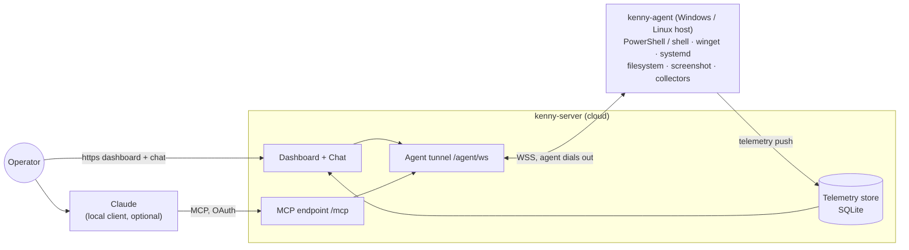

# kenny

**Self-hosted remote administration _and fleet monitoring_ for Windows and Linux, driven by
Claude (MCP) and a web dashboard.**

kenny administers a small fleet of Windows and Linux machines from one place: pushed telemetry
with server-side health rules and alerting, capability tools that act on a host, account
governance, a web filter and screen time, and a ticket queue the people who use those machines
can open themselves. Operate it through Claude over MCP, through the built-in chat, or by hand
in the console. It is for the machines **you** administer, with the consent of the people who
use them — family PCs, a home lab, a small office.

<figure markdown>
  
  <figcaption>The Today page — the fleet in one sentence, with the items that need attention ranked by consequence. See the <a href="dashboard/">dashboard reference</a> for the full tour.</figcaption>
</figure>

- **kenny-server** (Python / FastMCP) — MCP endpoint for Claude, the agent tunnel, the
  telemetry store (SQLite), and the operator dashboard. One ASGI app, one port.
- **kenny-agent** (Rust, single binary) — runs on each managed host, Windows or Linux, dials
  **out** to the server (NAT/firewall friendly), executes tool calls in the user's session,
  and pushes health snapshots.

## Where to next

- :material-rocket-launch: **[Setup & operations](setup.md)** — host the server, configure TLS
  and environment, build & distribute the agent.
- :material-book-open-variant: **[User guide](user-guide.md)** — operator workflows: dashboard,
  chat, running tools, onboarding and updating agents.
- :material-view-dashboard-outline: **[Dashboard reference](dashboard.md)** — every tab, widget,
  menu, and popup in the fleet console, with screenshots.
- :material-chart-box-outline: **[Telemetry reference](telemetry.md)** — every section the agent
  reports and the server-side health rule that grades it.
- :material-tools: **[Tool reference](tools.md)** — the capability and orchestration tools Claude
  can call, and the confirm-gate.
- :material-shield-account-outline: **[Parental controls](parental-controls.md)** — web activity,
  the web filter, and screen time.
- :material-bell-alert-outline: **[Alerting & digests](alerting.md)** — push alerts, the weekly
  digest, and disk/battery forecasts.
- :material-file-document-outline: **[Wire protocol](protocol.md)** — the agent⇄server contract
  (single source of truth, round-tripped by both sides).
- :material-sitemap: **[Architecture decisions](adr/README.md)** — MADR records for every significant choice.

## Contributing

kenny is open source under **[AGPL-3.0-only](https://github.com/nullthrone/kenny/blob/main/LICENSE)**.
See **[CONTRIBUTING](https://github.com/nullthrone/kenny/blob/main/CONTRIBUTING.md)**,
the **[Code of Conduct](https://github.com/nullthrone/kenny/blob/main/CODE_OF_CONDUCT.md)**, and the
**[Security policy](https://github.com/nullthrone/kenny/blob/main/SECURITY.md)** (report
vulnerabilities privately). Questions and ideas go to
**[Discussions](https://github.com/nullthrone/kenny/discussions)**.
