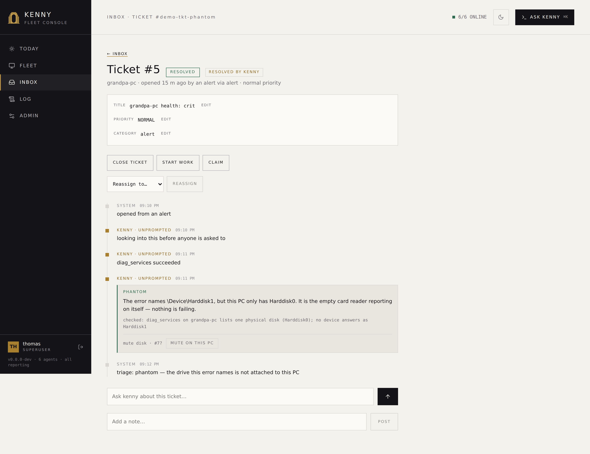

# Tickets & the Discord bot

kenny has a **Discord bot** you can add to your family's server. A family member mentions
it, kenny opens a private thread and works the problem right there — diagnosing on that
person's own PC, running the safe stuff itself, and asking you when something needs your
say-so. Every thread is also a **ticket**: a record you can read, search and act on from
the dashboard, whether it came from Discord, from you, or from an alert.

This page is the operator's guide to running that surface: what a ticket is, what kenny
may do without asking, how the two enrollment paths work, and the Discord application
setup you have to do yourself. **Why it is built this way — the trust model, the four
controls that make handing tool-use to a family member's chat message defensible — is
covered in the ADRs**, linked throughout; this page is about running it, not justifying it.

!!! warning "Consent and scope"
    This is for machines **you** administer, in a family setting, with the knowledge and
    consent of the people who use them. A Discord account only ever reaches the PCs *you*
    assign to the kenny account it is linked to — see
    [Enrollment: linking a Discord account](#enrollment-linking-a-discord-account) below.

## What a ticket is, and where it comes from

A ticket is one support conversation: a title, a state, the one PC it is about, a running
paraphrase of what happened, and a machine-readable trail of every message, tool call,
approval and state change underneath it. Three things can open one:

- **A Discord mention.** Someone `@kenny`s the bot in the support channel (or runs
  `/help-me`), kenny opens a private thread for it, and the ticket is born already
  pointed at that person's PC. If more than one PC could be meant, kenny asks first with a
  row of buttons and opens nothing until one is clicked — publicly, replying to the
  mention, or privately to the caller alone for `/help-me` — see
  [Which PC a request is about](#which-pc-a-request-is-about).
- **The dashboard.** Any signed-in account — including a scoped `user` — can open a ticket
  with **New ticket** in the [Inbox](dashboard.md#inbox). This is the same record type, it
  just starts without a Discord thread attached.
- **An alert.** A genuine alert (not a recovery, not the digest) can open its own ticket
  automatically, so a Defender-disabled or a failing-disk notification arrives with
  somewhere to work it, not just a push you have to remember. An alert-origin ticket has no
  requester — it belongs to the fleet, not a person — so only an operator can see or drive it.
  **Which events do this is configurable** — the **Auto-ticket rules** section of
  [Admin](dashboard.md#auto-ticket-rules) lets you narrow it (e.g. stop offline PCs from
  opening tickets) or widen it (e.g. promote an inventory change, like a new local admin
  account, into one). See
  [Alerting → which events open a ticket](alerting.md#which-events-open-a-ticket-is-configurable).

The dashboard is no longer just where you read, note, reassign and close a ticket — the
ticket detail view has its own **chat with kenny**, gated the same way Discord always was,
so a ticket opened without a Discord thread at all (or worked by an operator who isn't the
requester) is just as fully workable as one that came in over `@kenny`. See
[Ticket detail](dashboard.md#ticket-detail) and
[ADR-0050](adr/0050-the-ticket-is-its-own-chat-surface.md).

<figure markdown>
  
  <figcaption>The Inbox: every ticket you can see, grouped by who it's waiting on — an operator+ sees the whole queue, a scoped user only ever their own.</figcaption>
</figure>

Every ticket is pinned to **exactly one PC**, decided the moment it is created and never
moved by anything the requester or the assistant says afterward — only an operator can
**reassign** it, from the dashboard. That is deliberate: a ticket that could be quietly
retargeted mid-conversation would undercut every other guarantee on this page. See
[ADR-0046](adr/0046-ticket-as-entity-chat-thread-as-binding.md) for why the ticket, not the
chat thread, is the thing that actually exists.

## The lifecycle, in plain language

A ticket's lifecycle has two parts, shown together as one pill in the list and the detail
view: **where it is** and, while it is being worked, **who the ball is with**.

Where it is — one of five states:

| State | Meaning |
|---|---|
| `new` | Just created, nothing has happened yet. |
| `in_progress` | Being worked — by kenny, by you, or currently blocked on someone (see below). |
| `resolved` | The problem is fixed. Still reopenable. |
| `closed` | Done. **Terminal.** |
| `cancelled` | Withdrawn, by the requester or an operator. **Terminal.** |

Who the ball is with, while `in_progress` — a ticket can be **blocked on**:

| Blocked on | Meaning |
|---|---|
| *(none)* | Actively being worked, nobody is waiting on anyone. |
| `user` | Kenny is waiting on a reply from the person the ticket belongs to. |
| `approval` | A step needs **your** sign-off before it can continue. |
| `operator` | Kenny has done what it can on its own and is waiting on an operator to pick it up (including once it hits its per-ticket turn limit). |

A ticket blocked on `user` or `operator` for a while gets one reminder
(`KENNY_TICKET_STALL_NUDGE_SECS`, default 2 days), and a `user` block still unanswered after
longer (`KENNY_TICKET_STALL_GIVEUP_SECS`, default 7 days) is re-blocked on `operator` — the
person it was waiting on did not answer, so a human needs to pick it up. `approval` never
gets nudged by this: it has its own clock, the approval TTL below.

A `resolved` ticket auto-closes after a while if nobody touches it (`KENNY_TICKET_AUTOCLOSE_SECS`,
default 2 days) — a housekeeping sweep that runs alongside the alert and backup loops, not
anything the requester has to do. `closed` is final: reopening it is not possible, only the
`resolved` window before auto-close is the undo window.

An operator can call a ticket `resolved` from `new` or `in_progress` — including one
blocked on `approval` (a duplicate, or something that fixed itself before kenny got to it).
Resolving one that is still sitting on a pending approval request denies that request
rather than leaving it open: the sign-off is no longer meaningful once the ticket itself is
done. The requester can cancel their own ticket from `new` or `in_progress` at any time
(withdrawing it), and close it themselves once it is `resolved`.

<figure markdown>
  
  <figcaption>Ticket detail: the summary/resolution, and the timeline — messages, autonomous tool calls, a held approval, its decision, and the resolution, in order.</figcaption>
</figure>

## What kenny may do on its own, and what waits for you

Every tool kenny can call is one of three tiers — see [Tool reference](tools.md) for the
full breakdown. On the **ticket's own chat** — whether it's reached over Discord or from the
ticket detail view in the dashboard — the rules below apply identically: the same
`TicketPolicy` gate drives both, it just has two transports now. Whoever is typing on a
given turn (the ticket's own requester, or an operator working someone else's ticket from
the dashboard) decides which host-scope/capability-profile applies to *that* turn, but never
which host it targets — the target PC stays exactly as frozen as it always was:

- **Read-only** tools (looking at telemetry, listing processes, checking service status)
  run immediately.
- **Standard changes** — routine, reversible, low-blast-radius steps like flushing DNS or
  opening a remote-help session — run **autonomously**, with a trail row recording that
  they ran and why they were allowed to.
- **Normal changes** — everything else that changes state: running a shell command,
  installing or removing software, touching who may sign in to a PC — **always stop and
  wait for an operator**, no matter who is asking or what PC it is on.

This is a **property of the ticket's chat**, not of the tools themselves — and it is
distinct from the dashboard's separate **Ask kenny** overlay (the operator-only global
assistant, not tied to any one ticket), which still confirms *both* change tiers exactly
as it always has.
See [Tool reference § the confirm-gate](tools.md#three-tiers-and-who-enforces-what) for the
surface-by-surface table, [ADR-0045](adr/0045-tiered-tool-classification.md) for why the
tier and the gate are kept apart on purpose, and
[ADR-0050](adr/0050-the-ticket-is-its-own-chat-surface.md) for why the ticket detail view
qualifies for the same autonomy Discord always had.

When a step needs you, kenny posts an **approval card** — in the operator channel if you
configured one, otherwise in the ticket's own thread — with the exact tool and arguments.
The same held call renders inline in the [Inbox](dashboard.md#inbox)'s NEEDS YOU group,
and the header's **Inbox badge** counts it from anywhere in the dashboard. Approvals are
**persistent**: they survive a server restart, and they expire after
`KENNY_TICKET_APPROVAL_TTL_SECS` (default 24 h) — an expiry counts as a denial, and kenny
tells the requester so. See [`dashboard.md`](dashboard.md#approval-gates) for the Inbox's
inline decision and [Ticket detail](dashboard.md#ticket-detail) for the same gate on a
ticket's own timeline.

## kenny looks first, before you are asked to

A ticket used to be a question put to you. Most of them did not need your judgement —
they needed somebody to go and check. So kenny now does that first, unprompted: the
moment a ticket is created, it runs **one read-only investigation** on that ticket's PC
and writes what it found into the ticket, before you ever open it.

The point is that the raw signal often cannot answer the question it raises. A Windows
event reading *"bad block on device \Device\Harddisk1"* is alarming by every measure —
new, high volume, disk-related — and means nothing at all if that PC has no `Harddisk1`.
Whether it does is not in the event. It is only on the machine.

**What an investigation may do is deliberately small:**

- **Read-only tools only**, and not even all of them: nothing that looks at somebody's
  screen, reads their files, or lists the sites they visited. Those need the person's
  consent, and nobody is present in an investigation to give it. Everything that changes
  a PC is simply not available to it.
- **One PC** — the one the ticket is about, frozen when the ticket was created.
- **A bounded number of steps** (`KENNY_TRIAGE_MAX_ITERATIONS`, default 8). An
  investigation that runs out does not guess: it produces no verdict, and the ticket
  stays open with whatever it did find.

It ends with a **verdict**: *phantom* (the report names something that is not on this
PC), *benign known* (real but harmless, confirmed), *resolved itself*, *actionable* (a
real problem — this always stays open for you), or *inconclusive* (it could not tell, and
says what was missing). On a recurring reliability pattern it may also **suggest a
suppression rule** — a suggestion only; creating one stays yours.

### Letting kenny close what it checked

Off by default. With **Let triage resolve a ticket** (`KENNY_TRIAGE_RESOLVE`) on, kenny
may set a ticket to `resolved` itself — but only when all three hold:

1. the verdict is one that can close anything (never *actionable* or *inconclusive*),
2. **a read-only check actually ran and actually succeeded** on that ticket, and
3. the ticket was opened by an alert, not by a person.

The second is the important one, and it is the server's own check, not kenny's word for
it: a conclusion reached by reasoning alone cannot close a ticket, however confident it
sounds. Only having *looked* can. How sure kenny says it is plays no part — a model's
stated confidence is not a measurement, and it is exactly the thing a plausible-but-wrong
answer would get right.

### What you see

<figure markdown>
  
  <figcaption>An alert kenny looked into before anyone was asked to. The verdict, the
  evidence behind it, and the suppression it proposes — the whole answer without
  scrolling.</figcaption>
</figure>

The verdict lands on the ticket's timeline as a framed row: the verdict word, kenny's
one-sentence finding, and **what it checked** — the evidence sits with the verdict rather
than behind a click, because it is the reason to believe it. A verdict the server declined
to act on says why, which while the resolve switch is off is the most useful line on the
page: it tells you what would have happened with it on.

A ticket kenny resolved itself carries a **RESOLVED BY KENNY** chip next to its status, and
says so in the Inbox's DONE list too — so judging the hit rate is reading one list, not
opening every ticket. The chip goes away as soon as anyone moves the ticket: it describes
where the ticket stands now, not where it once did.

Where a verdict proposes muting a recurring event pattern, the row has a one-click button
that creates that suppression rule for that PC. Host-scoped on purpose — the investigation
looked at one machine and can only vouch for that one; widening a rule to the whole fleet
stays a separate decision in the [Reliability section](dashboard.md#reliability).

Nothing is closed outright: `resolved` keeps the full reopen window
(`KENNY_TICKET_AUTOCLOSE_SECS`, default 2 days), and you or the requester can put it back
to in-progress at any point in it. The verdict, its evidence and the fact that kenny
decided are all on the ticket's timeline.

Leave the switch off to keep every verdict as a recommendation — the investigation still
runs and still writes its findings, you just make the call. That is the sensible way to
start: read a few weeks of verdicts, then decide whether they earn the switch.

Turn the whole thing off with **Investigate new tickets automatically**
(`KENNY_TRIAGE_ENABLED`); tickets then arrive uninvestigated, as they did before. It also
stays off entirely without an `ANTHROPIC_API_KEY` — there is nothing to investigate with.

See [ADR-0056](adr/0056-unprompted-ticket-triage.md) for the reasoning and the three
controls that bound it.

## Operator approval vs. user consent — two different questions

A held step can be waiting on one of two different things, and they are not
interchangeable:

- **Operator approval** asks *"should the fleet change this way?"* — the security
  question. Only **you** (operator or superuser) can grant it, and the requester can never
  approve their own ticket's step, however routine it looks.
- **User consent** asks *"may kenny look at this person's screen, files, or browsing?"* —
  the privacy question, for `screen_capture`, `remotehelp_start`, `fs_read` and
  `web_activity_query`. Only the **ticket's requester** — the person it actually concerns —
  can grant it. **You cannot grant it on their behalf, even as the operator**: consent for
  someone else's privacy is not yours to give, and kenny refuses the attempt the same way
  it refuses a requester approving their own change.

If a single tool call needs both (opening remote help is a `standard_change` *and*
privacy-sensitive), consent is asked first; once it is answered, the call re-enters the
gate and — if it also needs an operator — asks for that next. A ticket only ever has **one**
open ask at a time. See [ADR-0047](adr/0047-capability-profiles.md) for consent as an axis
separate from authorization.

## Enrollment: linking a Discord account

kenny only ever acts as the **kenny account** a Discord snowflake is mapped to — never
from a display name, never from a Discord role. **That mapping is what decides whose
machines a person may ask about**, so it is worth getting right. There are two ways to
create it, both landing in the same table and both logged:

**A — the person links themselves.** They run `/link` in Discord. Kenny opens a
short-lived claim and hands back a code; you confirm it in **Admin → Discord & Tickets →
Pending claims**, picking which kenny account it belongs to. The claim expires on its own
if nobody confirms it.

**B — you link them directly.** In **Admin → Discord & Tickets**, **Pick a guild member**
lists everyone in the server (this needs the **Guild Members** intent — see below) and
lets you bind one straight to a kenny account, no code required.

<figure markdown>
  
  <figcaption>Admin → Discord & Tickets: connection status, linked accounts, pending claims, and the guild-member picker.</figcaption>
</figure>

Either way, the person can check what kenny thinks of them with `/whoami` — their
kenny account, role, capability profile, and which PCs it can see. That command exists
specifically so a mis-mapping is visible to the person it affects, not silent.

An account can be **unlinked** at any time (Admin → Discord & Tickets → the trash icon on
a linked row); a disabled/removed mapping makes that Discord user completely inert
again — no ticket, no reply, no model call, exactly as if they had never linked.

A user can also see and remove their **own** binding, from their [Profile](dashboard.md#profile)
— the raw Discord account id only, never a display name. Unlinking is self-service because
it only ever takes privilege away; *linking* stays the two-path operator-confirmed process
above, on purpose ([ADR-0044](adr/0044-delegated-identity-from-a-chat-platform.md)).

## Which PC a request is about

A ticket is about exactly one machine, and that machine is fixed before the ticket exists
— nothing said afterwards can move it ([ADR-0044](adr/0044-delegated-identity-from-a-chat-platform.md),
control 1). So "my PC is slow" has to be resolved to one host up front, and kenny never
infers it from the wording.

Two things decide it, and they are **not** the same question:

- **What the account may reach.** A scoped `user` account reaches only the hosts assigned
  to it. An operator or superuser reaches the whole fleet.
- **Which of those are its own.** The host scope in **Users → (a user) → Host scope**,
  which for an operator limits nothing and instead names the machines it lives with.

An unqualified request goes to the second list. One host on it → the ticket opens straight
away. More than one → kenny posts one button per host and opens nothing until the asker
clicks. A bare mention gets a public card replying to it; `/help-me` gets the same
buttons back as its own private reply, wherever the command was typed — including inside
an existing ticket thread, so it never leaks into the public support channel. Only the
person who asked can answer, the click is good once, and the chosen host is re-checked
against their scope at click time — a card that has been sitting around since before an
assignment changed does not get to use the old answer.

Set the host scope for an operator too. Without it every bare mention from an operator
account has to be answered with a question first, because reaching the whole fleet is
indistinguishable from owning all of it.

`/help-me host:<id>` still names any host the account may reach, whether or not it
is one of its own — the shortlist steers the default, it does not shrink the reach.

## Capability profiles

A **capability profile** is a named, per-account tool allowlist — it only ever *narrows*
what an account's role would otherwise allow, never widens it. Set it per user in
**Users → (a user) → Capability profile**.

| Profile | Roughly |
|---|---|
| `self-service-basic` | Diagnose your own PC, plus the standard changes (flush DNS, open remote help). No shell, no file reads, no browsing history, no account changes. |
| `power-user` | Also files, event log, screen captures, and package install/uninstall/update. Still no shell, no agent updates, no account governance. |
| `operator` | Unrestricted — today's behavior. |
| *(none set)* | Role default — the profile column is nullable on purpose. |

A profile applies everywhere that account acts — Discord and MCP alike — and it is
checked **twice**: the disallowed tool is not even offered to the model, and dispatch
refuses it again if it somehow got called anyway. See
[ADR-0047](adr/0047-capability-profiles.md) for why this is a profile column rather than a
fourth role.

## What is recorded, and what is not

Every ticket keeps two things: a **paraphrase** — the running summary and resolution you
read in the dashboard — and a **machine-readable event trail**: every message, tool call
(with its arguments), approval, consent and state change, in order, timestamped and
attributed. That trail is what the [ticket detail timeline](#the-lifecycle-in-plain-language)
shows you, and it is never pruned.

**Whether a `message` row carries the actual wording depends on where it came from.** A
message you type into the ticket's own chat in the dashboard, and every reply kenny sends —
whichever surface(s) it went out on — carries its verbatim text in the trail, so it survives
a restart and a raw-transcript prune and reads back exactly as written. A message from a
Discord thread still carries only a short summary, unchanged from before: the reasoning is
that a dashboard message (or an operator's own note) is curated work you chose to put on the
record, the same way an unbounded Ask kenny chat history already is, while a family member's
side of a Discord conversation is not something kenny needs to keep verbatim to operate the
system — kenny's own words are never a private conversation regardless of which door they
went out, so they are always kept in full. See
[ADR-0050](adr/0050-the-ticket-is-its-own-chat-surface.md) for the full reasoning, which
amends [ADR-0046](adr/0046-ticket-as-entity-chat-thread-as-binding.md) on this point. One
practical consequence: the trail was already never pruned, and it now grows with how much a
ticket's chat is actually used — there is still no knob to bound that.

The **raw transcript** — the verbatim back-and-forth kenny needs only to resume a ticket
after a restart — is working state, not the record. It is pruned after
`KENNY_TICKET_RETENTION_DAYS` (default 30 days) once a ticket is closed. Nothing about the
ticket, its summary, or its audit trail depends on the transcript still existing; deleting
it loses nothing you would ever need to read back.

Screenshots, file contents, event-log text and browsing history **never leave the server
toward Discord** — kenny summarises what it found in plain language and links to the
ticket in the authenticated dashboard for the detail. Discord threads are private (invite
the requester only) and slash commands answer ephemerally, but the output-redaction rule
holds regardless of thread privacy. **The same rule applies to the "also post in the
Discord thread" checkbox** in the dashboard's ticket chat: mirroring a reply to Discord is
opt-in per message, off by default, and only offered when the ticket has a bound thread —
and it goes through the same redaction a Discord-bound reply has always gone through, so
checking it never lets anything reach Discord that couldn't already reach it before.

**Lifecycle moves now reach the thread, too.** Resolving, cancelling or closing a ticket from
the dashboard — and the auto-close sweeper doing the same — used to be silent in Discord: the
thread just sat there while the ticket itself moved on. It now posts a short message and, at
a terminal state, archives the thread, the same way the Discord-driven `/close` path always
has.

## Setting up the Discord application

The bot needs its own Discord application — kenny cannot use Discord's own assistant
("Clyde" was retired at the end of 2024), and there is no shared kenny bot to add. This
part is on you, once, in the [Discord Developer Portal](https://discord.com/developers/applications):

### 1. Create the application and its bot

**Applications → New Application**, name it (this name and its avatar are what the family
sees — "kenny" and the dog mark keep it recognisable), then open the **Bot** tab and add a
bot.

While you are on that tab, turn **Public Bot** off unless you have a reason not to. It only
controls whether *other people* can invite your bot; leaving it on does not grant anyone
access to your server, but there is no reason to advertise it.

### 2. The token

**Bot → Token → Reset Token**, then copy the value. Discord shows a bot token exactly
once — there is no "reveal" later, so if you lose it you reset it again, and resetting
immediately invalidates the previous one.

Put it in `KENNY_DISCORD_BOT_TOKEN`. This one is **environment-only**: it is never written
to kenny's database and never editable in the Admin UI, so rotating it means changing
the environment and restarting. A leaked bot token lets anyone act as your bot in your
server — treat it like the operator token.

### 3. Privileged intents

Still on the **Bot** tab, under **Privileged Gateway Intents**:

| Intent | Needed for | If missing |
|---|---|---|
| **Message Content** | **Required.** Reading what someone actually wrote. | Mentions arrive with **empty content**. kenny cannot tell what was asked and the bot looks dead. This exact symptom is detected and reported once in the operator channel and in `/api/discord/status`, so it does not read as a silent hang. |
| **Server Members** | The guild-member picker (enrollment path B). | The picker returns an empty list with a warning; enrollment path A (`/link`) still works. |
| Presence | nothing — leave it off. | — |

kenny asks for no other intent. Under 100 servers these are toggles; above that Discord
requires verification, which a household install will never reach.

### 4. Bot permissions and the invite

Use **OAuth2 → URL Generator** rather than writing the URL by hand — it computes the
permission bits for you.

**Scopes:** `bot` **and** `applications.commands`. The second one is easy to forget and is
what allows the slash commands to be registered; without it the bot joins and the
the slash commands never appear.

**Bot permissions** — check exactly these:

| Permission | Why |
|---|---|
| View Channels | See the support and operator channels at all |
| Send Messages | Reply, and post approval cards |
| Send Messages in Threads | Everything after a ticket is opened happens in a thread |
| Create Private Threads | A ticket thread is private by default (`KENNY_DISCORD_PRIVATE_THREADS`) |
| Manage Threads | Archive and lock a thread when its ticket closes |
| Read Message History | Read the thread it is working in |
| Embed Links | Approval cards are embeds |

Nothing else. kenny never posts files or images to Discord — screenshots, file contents and
event-log text are deliberately kept on the server — so it needs no attachment permission,
and it never moderates, so it needs no kick, ban or role permission. If you are tempted to
grant Administrator to "make it work", don't: it will not fix a missing intent, which is the
usual real cause.

Open the generated URL, pick your server, and authorise.

**Channel overwrites can still block it.** Server-level permissions are not the whole story
— if the support or operator channel has its own permission overwrites, add the bot's role
there too. A bot that can see the server but not the channel behaves exactly like one that
was never invited.

### 5. Point kenny at the right places

Turn on **User Settings → Advanced → Developer Mode**, then right-click a server or channel
and **Copy ID** to get the snowflakes for:

- **`KENNY_DISCORD_GUILD_IDS`** — the server(s) kenny may react in. **This is a hard
  allowlist and an empty one denies everywhere**; there is no allow-all mode, on purpose. An
  event from any other guild is dropped before anything else happens, including before the
  author is looked up.
- **`KENNY_DISCORD_SUPPORT_CHANNEL_ID`** — where a mention opens a ticket.
- **`KENNY_DISCORD_OPERATOR_CHANNEL_ID`** — where approval cards go (the ticket thread
  otherwise).

Restrict the operator channel to yourself as good hygiene — but understand what that is and
is not. Deciding an approval requires the kenny `operator` role either way; channel
visibility governs who *sees* the card, not who may act on it. Discord roles are never read
as authorization ([ADR-0044](adr/0044-delegated-identity-from-a-chat-platform.md)), so this
is defence in depth, not the control.

### 6. Switch it on

Set `KENNY_DISCORD_ENABLED=1` and restart. The bot connects on startup; nothing happens
before that, and nothing happens at all without a token.

### Checking it actually worked

**Admin → Discord & Tickets** shows the gateway status. Three things it will tell you:

- **connected** — the gateway is up.
- **failed to start** with a reason — most often the optional `discord.py` dependency is
  missing from a source install (the published image ships it), or the token is rejected.
- a **Message Content** warning — the intent is off; mentions are arriving empty.

Then mention the bot in the support channel. You should get a private thread. If nothing
happens at all, work down: is the account linked (`/whoami`), is the guild on the
allowlist, can the bot see the channel?

An unmapped Discord account is **completely inert** by design — no thread, no reply, not
even a model call — so "the bot ignores me" is the expected behaviour before enrollment,
not a fault.

A server with no Discord configuration at all still runs the full ticket surface — the
store, the lifecycle, the dashboard's Inbox and API all work with nothing pointed at
Discord; only the bot connection itself is opt-in. See [`setup.md`](setup.md) for the
complete environment-variable reference and [ADR-0044](adr/0044-delegated-identity-from-a-chat-platform.md)
for why Discord roles are never read as authorization, however tempting that shortcut looks.

## See also

- [`dashboard.md`](dashboard.md) — the Inbox, its inline approval gates, and the Admin →
  Discord & Tickets panel, widget by widget.
- [`tools.md`](tools.md) — the three tool tiers and the full confirm-gate table.
- [`alerting.md`](alerting.md) — how an alert opens a ticket, how to configure which ones do,
  and the Discord webhook notification channel.
- [ADR-0044](adr/0044-delegated-identity-from-a-chat-platform.md) — delegated identity,
  no parallel authorization.
- [ADR-0045](adr/0045-tiered-tool-classification.md) — the tier belongs to the tool, the
  gate to the surface.
- [ADR-0046](adr/0046-ticket-as-entity-chat-thread-as-binding.md) — the ticket is the
  entity; the chat thread is a binding.
- [ADR-0047](adr/0047-capability-profiles.md) — capability profiles as a third
  authorization axis.
- [Alerting → which events open a ticket](alerting.md#which-events-open-a-ticket-is-configurable) — operator-configurable
  auto-ticket rules.
- [ADR-0050](adr/0050-the-ticket-is-its-own-chat-surface.md) — the ticket detail view as a
  second chat surface, verbatim trail wording, and the closed lifecycle-notification gap.
