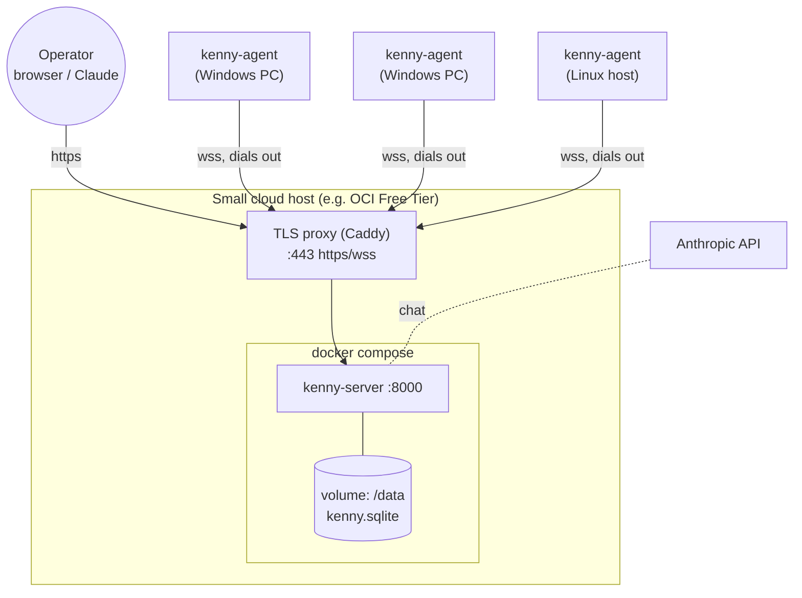
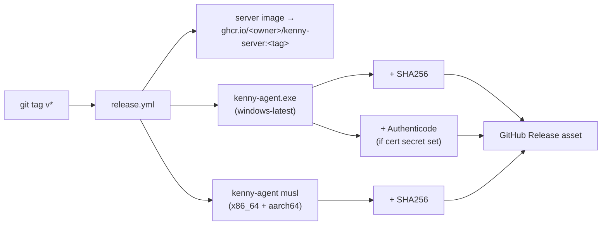

# kenny — Setup & Operations

How to host **kenny-server**, configure it, build and distribute **kenny-agent**, and cut releases.
For day-to-day operator use, see [`user-guide.md`](user-guide.md).

## Topology



## Prerequisites

- A host with Docker + Docker Compose (server), reachable by the agents over TLS.
- A DNS name + TLS for production (the bundled Caddy profile can obtain certs automatically).
- For the dashboard chat: an `ANTHROPIC_API_KEY`.
- To build the agent / cut releases: a GitHub repo with Actions (the workflow targets `windows-latest`).

## Quick start (Docker Compose)

```bash
# from the repo root
KENNY_OPERATOR_TOKEN="$(openssl rand -hex 24)" \
KENNY_AGENT_TOKENS="example-pc=$(openssl rand -hex 16),example-laptop=$(openssl rand -hex 16)" \
ANTHROPIC_API_KEY="sk-ant-..." \
docker compose up --build -d
```

The server is now on `http://localhost:8000` (data persists on the `kenny-data` volume). Open `/`
and complete **first-run setup**: the first account you create becomes the **superuser**
(ADR-0033). From there a superuser manages accounts under the header user menu → *Users*
(roles `superuser` / `operator` / `user`, per-user host scope, and personal access tokens).
Claude Desktop connects to `/mcp` through kenny's built-in **OAuth 2.1** flow
([ADR-0037](adr/0037-oauth2-authorization-server-for-mcp.md)): add a custom connector with the
`https://<server>/mcp` URL, sign in with your kenny account, and approve once — no token to paste.
Scripts and other MCP clients can still send a per-user access token (`Authorization: Bearer <pat>`)
instead. The `KENNY_OPERATOR_TOKEN(S)` below stay accepted as a back-compat superuser so existing
installs upgrade with no manual steps. For TLS in front (port 443, `wss`), enable the Caddy profile:

```bash
KENNY_DOMAIN=kenny.example.com KENNY_OPERATOR_TOKEN=... docker compose --profile tls up -d
```

Behind a reverse proxy, set `KENNY_FORWARDED_ALLOW_IPS` to the proxy's address so the
login rate-limiter throttles by the real client IP rather than the proxy's (otherwise all
clients share one bucket). The bundled TLS profile sets this for you.

## Environment variables

| Variable | Used by | Default | Purpose |
|----------|---------|---------|---------|
| `KENNY_OPERATOR_TOKEN` | server | *insecure dev fallback* | Legacy shared bearer token; still accepted as a **back-compat superuser** for MCP + `/api` after the upgrade to accounts (ADR-0033). Deprecated in favour of per-user access tokens. |
| `KENNY_OPERATOR_TOKENS` | server | — | Optional comma-separated set of additional accepted shared tokens (each a back-compat superuser). |
| `KENNY_SESSION_TTL_SECS` | server | `604800` | Browser login session lifetime in seconds (default 7 days). |
| `KENNY_OAUTH_ACCESS_TTL_SECS` | server | `3600` | Lifetime of an OAuth access token issued to a connected MCP client (default 1 hour). |
| `KENNY_OAUTH_REFRESH_TTL_SECS` | server | `2592000` | Lifetime of a rotating OAuth refresh token (default 30 days); reuse of a rotated token revokes the whole grant. |
| `KENNY_AGENT_TOKENS` | server | dev map | `id=token,id2=token2` — per-agent tokens (the token store is seeded from this). |
| `ANTHROPIC_API_KEY` | server | — | Enables the dashboard chat. |
| `KENNY_CHAT_MODEL` | server | `claude-sonnet-4-6` | Model for the chat loop. |
| `KENNY_TLS` | server | unset | Set `1` behind TLS so the login cookie gets the `Secure` flag. |
| `KENNY_FORWARDED_ALLOW_IPS` | server | `127.0.0.1` | Upstream proxy address(es) allowed to set `X-Forwarded-For`, so the login rate-limiter sees the real client IP behind a reverse proxy (not the proxy's). Set to your proxy's address when fronting kenny with the Caddy TLS profile. |
| `KENNY_PUBLIC_URL` | server | `http://localhost:<port>` | External base URL; used to build installer/update links, the agent `--server` `wss://…/agent/ws`, and the **OAuth** issuer / discovery-metadata / resource URLs. Set it to your public `https://…` origin so Claude Desktop's OAuth flow advertises reachable endpoints. |
| `KENNY_AGENT_BINARY` | server | — | Path to the prebuilt `kenny-agent.exe` the server serves for **Windows** installer download + self-update. Overrides the GitHub auto-fetch when set. |
| `KENNY_AGENT_BINARY_LINUX` | server | — | Path to the prebuilt **Linux** `x86_64` agent binary (static musl) the server serves for the Linux install script + self-update. Overrides the GitHub auto-fetch when set. |
| `KENNY_AGENT_BINARY_LINUX_AARCH64` | server | — | As above for **Linux `aarch64`** (Raspberry Pi / ARM NAS). |
| `KENNY_GITHUB_TOKEN` | server | — | Token for polling a **private** `kenny-server` package on GHCR (ADR-0040). The agent binary and the changelog are read from GitHub anonymously (ADR-0057) and ignore it. |
| `KENNY_GITHUB_REPO` | server | `nullthrone/kenny` | Repo to fetch the agent binary release from. |
| `KENNY_AGENT_BINARY_CACHE` | server | `<dir of KENNY_DB_PATH>/kenny-agent.exe` | Where the auto-fetched binary is cached (the `/data` volume in the container). |
| `KENNY_AGENT_VERSION` | server | `0.2.0` | **Fallback** version label only — the GitHub release tag of the fetched binary leads (ADR-0015). Used when no tag is known (e.g. a manually-placed binary without a `.version` sidecar). |
| `KENNY_HOST` / `KENNY_PORT` | server | `127.0.0.1` / `8000` | Bind address (container sets `0.0.0.0`). |
| `KENNY_DB_PATH` | server | `kenny.sqlite` | SQLite store (snapshots, events, tokens, keys, chat, web filter — one file). Container: `/data/kenny.sqlite`. |
| `KENNY_TELEMETRY_RETENTION_DAYS` | server | `30` | How long raw telemetry snapshots are kept (dashboard-editable, ADR-0051). Snapshots dominate this database's size (~90 KB/row); lowering this is the main lever on disk usage. A decrease prunes on the next alert cycle (~60s); `DELETE` frees space for reuse but does not shrink the file — restore from a backup or `VACUUM` offline to reclaim disk. |
| `KENNY_SQLITE_BUSY_TIMEOUT_MS` | server | `20000` | How long a write waits for a contended SQLite lock before raising "database is locked" (ADR-0051). Read once at process start; not editable at runtime. |
| `KENNY_TELEMETRY_INTERVAL_SECS` | agent / server | `900` | Agent push interval; also pre-filled into generated installers. |
| `KENNY_COEXIST_ENABLED` | agent | `1` | Anti-cheat coexistence (ADR-0035): while a protected game runs, the agent suspends `screen_capture` (returns `paused`) and relaxes process/port telemetry. Set `0` to disable. |
| `KENNY_COEXIST_PROCESSES` | agent | anti-cheat set | Comma-separated extra process names to treat as "a protected game is running", extending the built-in anti-cheat list (`EasyAntiCheat.exe`, `BEService*.exe`, …). Add game exes here, e.g. `ARC-Raiders.exe`. Matched case- and `.exe`-insensitively. |
| `KENNY_COEXIST_POLL_SECS` | agent | `5` | How often the agent checks whether a watched process is running. |
| `KENNY_COEXIST_TELEMETRY_INTERVAL_SECS` | agent | `3600` | Telemetry push interval while a protected game is running (never shorter than `KENNY_TELEMETRY_INTERVAL_SECS`). |
| `KENNY_SERVER_VERSION` | server | `0.0.0-dev` | Version string shown on the sidebar's fleet line, in the **About kenny** dialog, and in `/api/about`. |
| `KENNY_LOG_LEVEL` | server | `INFO` | Root log level. Server logs are also persisted to the event store (ADR-0017). |

**Agent authentication & identity** (ADR-0022 mutual Ed25519 auth, token rotation):

| Variable | Default | Purpose |
|----------|---------|---------|
| `KENNY_SERVER_PRIVATE_KEY` | *generated + logged* | Base64 32-byte Ed25519 seed — the server identity agents pin. If unset the server generates one at startup and logs the public key to pin in installers; set it (or `KENNY_SERVER_PRIVATE_KEY_FILE`) to keep identity stable across restarts. |
| `KENNY_TOKEN_GRACE_SECS` | `604800` | Grace window (7 d) during which a rotated agent token still works; `0` = instant invalidation. |
| `KENNY_KEY_GRACE_SECS` | `604800` | Grace window for a rotated agent public key. |
| `KENNY_ALLOW_TOKEN_AUTH` | `1` | Accept the legacy bearer-token agent handshake during migration (disable once all agents are enrolled). |
| `KENNY_MAX_FRAME_BYTES` | `8388608` | Absolute inbound frame ceiling (8 MiB). |
| `KENNY_MAX_TELEMETRY_BYTES` | `262144` | Per-push byte cap (256 KiB). |
| `KENNY_MAX_TELEMETRY_SECTIONS` | `128` | Max sections per snapshot. |

**Alerting, digest & notifications** (see **[Alerting & digests](alerting.md)**):

| Variable | Default | Purpose |
|----------|---------|---------|
| `KENNY_ALERT_INTERVAL_SECS` | `60` | Alert-evaluation loop interval; `0` disables alerting. |
| `KENNY_ALERT_COOLDOWN_SECS` | `3600` | Per-scope flap-suppression cooldown for `warn` transitions. |
| `KENNY_ALERT_OFFLINE_AFTER_SECS` | `2700` | Mark an agent offline after this long without a push (≈ three missed 15-min pushes). |
| `KENNY_DIGEST_ENABLED` | `1` | Weekly digest on/off. |
| `KENNY_DIGEST_DAY` / `KENNY_DIGEST_HOUR` | `mon` / `8` | When to send the weekly digest. |
| `KENNY_NTFY_URL` / `KENNY_NTFY_TOKEN` | — | ntfy topic URL (+ optional bearer) for push alerts. Also editable in Admin → Alerting & Digest, where a saved value wins over this one. |
| `KENNY_WEBHOOK_URL` | — | Generic JSON webhook for alerts. Also editable in Admin → Alerting & Digest. |

**Database backups** (see the **[Backup section](dashboard.md#backup)**,
[ADR-0039](adr/0039-server-database-backup-and-restore.md)):

| Variable | Default | Purpose |
|----------|---------|---------|
| `KENNY_BACKUP_INTERVAL_SECS` | `21600` (6 h) | Scheduled-backup loop interval; `0` disables (restart to re-enable). Re-read live, so a dashboard change retimes the running loop. |
| `KENNY_BACKUP_INITIAL_DELAY` | `30` | Delay before the first scheduled backup after startup. |
| `KENNY_BACKUP_RETENTION` | `7` | Snapshots kept per target before older ones are pruned. |
| `KENNY_BACKUP_DIR` | `<dir of KENNY_DB_PATH>/backups` | Where local snapshots are written — the directory to point an external sync tool at. |

**Parental controls / web filter** (see **[Parental controls](parental-controls.md)**):

| Variable | Default | Purpose |
|----------|---------|---------|
| `KENNY_WEBFILTER_REFRESH_SECS` | `86400` | External adult/bypass list refresh interval; `0` disables. |
| `KENNY_WEBFILTER_ADULT_URL` | StevenBlack list | Source URL for the porn-only hosts list. |
| `KENNY_WEBFILTER_BYPASS_URL` | hagezi list | Source URL for the DoH/VPN/proxy bypass list. |
| `KENNY_WEBFILTER_MAX_BLOCK_DOMAINS` | `5000` | Cap on external-adult domains pushed to an agent (hard cap 10 000). |

**Discord bot & tickets** (see **[Tickets & the Discord bot](itsm.md)** for the full
operator setup walkthrough — creating the Discord application, the two privileged intents,
and both enrollment paths). Tickets themselves need none of this: the ticket store,
lifecycle service and sweeper always run, and the dashboard's Inbox and `/api/tickets`
work with nothing configured here. These keys only decide whether a Discord bot is also
connected, install the optional dependency first: `pip install -e ".[discord]"`.

| Variable | Default | Purpose |
|----------|---------|---------|
| `KENNY_DISCORD_BOT_TOKEN` | — | Bot token of the Discord application. Unset keeps the whole Discord surface off. |
| `KENNY_DISCORD_ENABLED` | `0` | Connect the bot at startup. Needs the token above and at least one allowed guild. |
| `KENNY_DISCORD_GUILD_IDS` | — | Comma-separated guild (server) snowflakes kenny reacts in. **Empty means deny everywhere** — there is no allow-all mode. |
| `KENNY_DISCORD_SUPPORT_CHANNEL_ID` | — | Channel a mention has to be in to open a ticket; empty accepts a mention in any channel of an allowed guild. |
| `KENNY_DISCORD_OPERATOR_CHANNEL_ID` | — | Where operator approval cards are posted; empty posts them into the ticket's own thread. |
| `KENNY_DISCORD_PRIVATE_THREADS` | `1` | Open each ticket in a private thread with only the requester invited. |
| `KENNY_DISCORD_MODEL` | — | Anthropic model id for the Discord surface; empty falls back to `KENNY_CHAT_MODEL`. |
| `KENNY_DISCORD_MAX_TURNS_PER_TICKET` | `40` | Autonomous turn cap per ticket before it is handed to an operator. Ticket-wide (any turn on the ticket, from Discord or the dashboard's ticket chat), except an operator+-driven turn from either surface never counts against it. |
| `KENNY_DISCORD_RATE_LIMIT_PER_USER_HOUR` | `20` | Per-account throttle on opening/driving tickets, ticket-wide across both surfaces; `0` = unlimited. An operator+-driven turn, from either surface, is exempt. |
| `KENNY_DISCORD_WEBHOOK_URL` | — | Discord incoming-webhook URL for the alert push channel — independent of the bot. Also editable in Admin → Alerting & Digest; see [Alerting & digests](alerting.md#notification-channels). |
| `KENNY_TICKET_APPROVAL_TTL_SECS` | `86400` | How long a held approval/consent waits for a decision before the sweeper expires it (an expiry counts as a denial); `0` never expires. |
| `KENNY_TICKET_AUTOCLOSE_SECS` | `172800` | Reopen window: a `resolved` ticket untouched this long is auto-closed; `0` disables. |
| `KENNY_TICKET_SWEEP_INTERVAL_SECS` | `300` | Ticket housekeeping loop interval (expires gates, auto-closes); `0` disables (restart to re-enable). Re-read live. |
| `KENNY_TICKET_SWEEP_INITIAL_DELAY` | `30` | Delay before the first sweep after startup. |
| `KENNY_TICKET_RETENTION_DAYS` | `30` | How long a **closed** ticket keeps its raw working transcript. The ticket, its summary and its audit trail are never pruned. |
| `KENNY_TRIAGE_ENABLED` | `1` | On a new ticket, run one read-only investigation on its PC and write the finding into the ticket before anyone is asked to look. Needs `ANTHROPIC_API_KEY`; without one it stays off whatever this says. See [Tickets → kenny looks first](itsm.md#kenny-looks-first-before-you-are-asked-to). |
| `KENNY_TRIAGE_RESOLVE` | `0` | Let an investigation set a ticket to `resolved` itself — only for an alert-opened ticket, only on a closing verdict, and only when a read-only check actually ran and succeeded. Off means every verdict is a recommendation. |
| `KENNY_TRIAGE_MAX_ITERATIONS` | `8` | Model round-trips one investigation may take. Spending them all produces no verdict: the ticket stays open with what was found. |

Everything above except the bot token and the webhook URL (secrets, env-only) is also
editable from the dashboard's **[Admin](dashboard.md#admin) → Discord & Tickets** section —
most apply immediately, and `KENNY_DISCORD_ENABLED`/`KENNY_DISCORD_GUILD_IDS`/
`KENNY_TICKET_SWEEP_INITIAL_DELAY` need a restart, exactly like the other loop-startup
settings on this page.

> **Security:** if `KENNY_OPERATOR_TOKEN` is unset the server uses a loud, insecure dev token. Always
> set real tokens and serve over `wss`/`https` for anything non-local. See
> [`adr/0008-operator-authentication.md`](adr/0008-operator-authentication.md) and
> [`adr/0014-auth-hardening.md`](adr/0014-auth-hardening.md).

## Running from source (development)

```bash
# server
cd kenny-server && pip install -e ".[dev]"
KENNY_OPERATOR_TOKEN=dev KENNY_HOST=127.0.0.1 KENNY_PORT=8000 kenny-server

# agent (foreground; Linux builds via cfg fallbacks)
cd kenny-agent && cargo run -- --server ws://127.0.0.1:8000/agent/ws \
  --agent-id dev --token dev-token --telemetry-interval-secs 30
```

`/e2e` runs a real agent↔server smoke test; `/contract-check` verifies both sides match the wire
contract and golden fixtures.

## Enabling agent downloads from the GUI

The server serves a **prebuilt** binary; it does not compile per download (see
[`adr/0012-agent-distribution-prebuilt-binary.md`](adr/0012-agent-distribution-prebuilt-binary.md)). Point it at a binary and set the
public URL:

```yaml
# compose.yaml (server service) — excerpt
environment:
  KENNY_PUBLIC_URL: https://kenny.example.com
  KENNY_AGENT_BINARY: /data/kenny-agent.exe   # mount/copy the release artifact here
  KENNY_AGENT_VERSION: "0.2.0"
```

Then the dashboard's **download installer** / **share link** / **update agent** buttons work. The
installer bundles `setup.bat` + a `kenny-agent.setup.json` sidecar carrying the per-agent
`--server`, `--agent-id`, a minted one-time `--enroll-token`, and the pinned `--server-pubkey`. The
relative double-clicks `setup.bat`; the agent self-elevates and installs itself into
`%ProgramFiles%\kenny` (see
[`adr/0030-agent-self-elevating-bootstrap-installer.md`](adr/0030-agent-self-elevating-bootstrap-installer.md)).

The **Add a PC** wizard's second step asks for the target OS. For a **Linux** target, point
the server at a Linux binary as well and the wizard's hand-over step produces a one-line
install command instead of a ZIP (see
[Installing the agent on Linux](#installing-the-agent-on-linux) and
[`adr/0034-linux-agent-distribution-convenience-script.md`](adr/0034-linux-agent-distribution-convenience-script.md)):

```yaml
environment:
  KENNY_AGENT_BINARY_LINUX: /data/kenny-agent-linux-x86_64          # static musl x86_64
  KENNY_AGENT_BINARY_LINUX_AARCH64: /data/kenny-agent-linux-aarch64 # optional, Raspberry Pi / ARM NAS
```

### Auto-fetch from GitHub (no manual binary placement)

To avoid the first-agent chicken-and-egg (hand-placing the `.exe` into the volume before any
installer can be downloaded), the server can fetch the binary itself when a GitHub token is
configured (ADR-0015). No credential is involved — releases are read anonymously (ADR-0057):

```yaml
environment:
  KENNY_GITHUB_REPO: nullthrone/kenny         # default
```

On startup (and via the dashboard's **retry GitHub fetch** button) the server downloads the latest
release's agent binaries — `kenny-agent-<tag>-x86_64-pc-windows-msvc.exe` and the Linux
`…-<arch>-unknown-linux-musl` variants — verifies each against its published `.sha256`, and caches
them on the `/data` volume. The fetch is **best-effort** and per-asset — if the repo is unreachable
the dashboard shows a banner with manual instructions instead. Operator-placed
`KENNY_AGENT_BINARY` / `KENNY_AGENT_BINARY_LINUX` always win over the fetched cache. The dashboard's
**Add a PC** wizard lets you onboard the very first machine without a pre-existing agent.

Best-effort does not mean quiet. Every attempt is recorded, including the one branch that decides not
to fetch at all (an operator-placed binary taking precedence), and the outcome survives a restart.
**About kenny** shows it on the *staged agent version* row and Fleet's banner repeats it, so a stale
staged version always comes with the reason it stopped moving.

Two failures are worth recognising by name. A **403** is either GitHub's rate limiter or a refusal;
the dashboard says which, and for the limiter it names the reset time. Because reads are anonymous
the limit is 60 requests per hour **per IP**, shared with anything else behind the same address —
kenny's own draw is a fraction of that. A **404** means the repo is not public: auto-fetch cannot
reach a private release repo at all, and that deployment needs `KENNY_AGENT_BINARY` placed by hand.

## Installing the agent on Windows

The normal path is the dashboard bundle: **double-click `setup.bat` and approve the Windows
security prompt**. `setup` reads `kenny-agent.setup.json`, elevates via UAC, copies the binary into
`%ProgramFiles%\kenny`, and registers the auto-start service — no unzip-and-right-click ritual (see
[`adr/0030-agent-self-elevating-bootstrap-installer.md`](adr/0030-agent-self-elevating-bootstrap-installer.md)
and [`adr/0013-agent-windows-service-and-self-update.md`](adr/0013-agent-windows-service-and-self-update.md)).

The single binary manages its own service. For manual/debugging use:

```powershell
kenny-agent.exe setup              # self-elevating install (config from kenny-agent.setup.json,
                                   #   or pass the flags below explicitly)

# equivalent explicit install (run as Administrator):
kenny-agent.exe install --server wss://kenny.example.com/agent/ws `
  --agent-id example-pc --server-pubkey <base64> --enroll-token <token> `
  [--telemetry-interval-secs 900] [--service-name kenny-agent]

kenny-agent.exe uninstall          # remove the service (and the %ProgramFiles%\kenny install dir)
kenny-agent.exe run                # foreground (default when no subcommand) — for debugging
```

`--server-pubkey` pins the server identity and `--enroll-token` is the one-time enrollment secret
(ADR-0022); a bare legacy `--token` is only accepted during the migration window. `install` writes
`kenny-agent.config.json` next to the exe and registers an auto-start service with
restart-on-failure recovery. Updates are pushed from the server (no manual reinstall).

## Installing the agent on Linux

kenny-agent runs on Linux hosts too — headless servers, a NAS, a Raspberry Pi, or a Linux desktop
— reporting into the same fleet through the same server (ADR-0031). The agent is a **static musl
binary** with no runtime dependencies, installed as a **systemd service**. Distribution follows the
Docker/K3s convenience-script model (ADR-0034).

The normal path is the dashboard's **one-line install command**. In the **Add a PC** wizard,
name the machine, pick *Linux*, and copy the command its hand-over step produces — then run
it on the target host as root:

```bash
curl -fsSL https://kenny.example.com/d/install/<nonce> | sudo sh
```

The nonce-gated, single-use script carries the per-agent `--server`, `--agent-id`, a minted
one-time `--enroll-token`, and the pinned `--server-pubkey`. It detects the CPU architecture
(`x86_64` / `aarch64`), downloads the matching binary from the server, and runs `kenny-agent
setup`, which copies the binary into `/opt/kenny`, writes its config to `/etc/kenny`, and enables
an auto-start systemd unit. On first run the agent generates its Ed25519 keypair and enrolls its
public key. Verify with:

```bash
systemctl status kenny-agent          # unit active, ExecStart=/opt/kenny/kenny-agent run-service
journalctl -u kenny-agent -f          # follow the agent log
```

The single binary manages its own service. For a manual / air-gapped install, download
`kenny-agent-<tag>-<arch>-unknown-linux-musl` from the
[latest release](https://github.com/nullthrone/kenny/releases/latest), then (as root):

```bash
chmod +x kenny-agent-*-unknown-linux-musl
sudo ./kenny-agent-*-unknown-linux-musl setup \
  --server wss://kenny.example.com/agent/ws --agent-id study-pi \
  --server-pubkey <base64> --enroll-token <token> [--telemetry-interval-secs 900]

sudo kenny-agent uninstall             # disable + remove the systemd unit
```

Paths on Linux: binary in `/opt/kenny`, config in `/etc/kenny`, state/key in `/var/lib/kenny`,
logs in `/var/log/kenny`. There is no tray kill-switch or session-0/desktop launch on Linux (those
are Windows-only, ADR-0031); a headless server needs neither.

**Upgrades are server-triggered, exactly like Windows** — click **update** on the agent in the
dashboard (or `POST /api/agents/{id}/update`). The agent downloads the new binary, verifies its
SHA-256, atomically swaps `/opt/kenny/kenny-agent`, and restarts its systemd unit; no manual step
on the host (ADR-0034).

## Releases (GHCR image + agent binaries)

Tag a version to publish (`.github/workflows/release.yml`):

```bash
git tag v0.2.0 && git push origin v0.2.0
```



- The server image lands in GHCR (semver + `latest`, with provenance).
- The Windows agent binary is built on `windows-latest`, hashed, optionally code-signed when
  `WINDOWS_CERT_BASE64` / `WINDOWS_CERT_PASSWORD` repo secrets are set, and attached to the Release.
- The Linux agent binaries are cross-built as **static musl** artifacts (`cross`),
  `kenny-agent-<tag>-x86_64-unknown-linux-musl` and `…-aarch64-unknown-linux-musl`, each hashed and
  attached to the Release. The x86_64 build is e2e-gated before publish.
- Pull the release binaries to the host and point `KENNY_AGENT_BINARY` (Windows) and
  `KENNY_AGENT_BINARY_LINUX` / `KENNY_AGENT_BINARY_LINUX_AARCH64` (Linux) at them to enable GUI
  downloads/updates against that version — only needed for a private repo, since the server
  auto-fetches all of them from a public one on its own.

### Dev channel (ADR-0048)

Every push to `main` additionally publishes a **prerelease** build (`.github/workflows/release-dev.yml`,
tag `v<next-patch>-dev.<run_number>`) via the same shared job body
(`.github/workflows/_release-artifacts.yml`) and the same publish gate (image smoke test, e2e
against the exact release binary) as a stable tag — nothing about how an artifact is verified
differs by channel. Because GitHub Releases marks it `prerelease: true`, the stable resolution
path (`GET /repos/{repo}/releases/latest`) never sees it, so the dev channel cannot affect stable
agents or the stable server image. The server image also gets a floating `:edge` GHCR tag as a
convenience `docker pull` alias; nothing server-side resolves or pins against it — detection always
uses the exact versioned tag + digest.

To run one PC on dev while the rest of the fleet stays stable: set that agent's **desired channel**
to `dev` in the dashboard (or `POST /api/agents/{id}`), then approve a dev-channel update campaign
the same way as a stable one. Only agents whose desired channel matches the campaign's channel are
eligible — a dev campaign never touches an agent an operator hasn't opted in. A locally built agent
can also self-identify as dev from the start via `KENNY_AGENT_CHANNEL=dev cargo build --release`
(stamped into `register.meta.channel` and the `os_support` telemetry section).

### Code signing (Authenticode)

An unsigned agent binary is more likely to be flagged by AV and game anti-cheat heuristics, and
carries no verifiable publisher identity. The Windows build already carries PE identity metadata
(CompanyName/ProductName/version + icon, ADR-0035); **signing it is the complementary step** and
is wired but off by default:

- Set the `WINDOWS_CERT_BASE64` (base64 of the signing cert) and `WINDOWS_CERT_PASSWORD` repo
  secrets; `release.yml` then Authenticode-signs `kenny-agent.exe` with a timestamp. The server
  ships the exe **unmodified** (ADR-0030/0012), so the signature survives distribution and
  self-update.
- Use a real **OV or EV** code-signing certificate whose subject matches the VERSIONINFO
  CompanyName. Since the 2023 CA/Browser-Forum change, code-signing keys must live on
  FIPS-140-2 hardware, so a plain PFX-in-secret may need swapping for a cloud-signing service
  (e.g. Azure Trusted Signing, DigiCert KeyLocker, SSL.com eSigner) invoked via `signtool`.
- A formal anti-cheat *allowlist* is generally not available to a self-hosted family tool;
  signing + the coexistence back-off (ADR-0035) are the practical levers. Never attempt to
  evade an anti-cheat — that risks banning the player's game account.

## Persistence, backups, upgrades

- **Data**: the SQLite telemetry store lives on the `kenny-data` volume (`/data`). Telemetry
  snapshots auto-prune after ~30 days.
- **Backups**: kenny has a built-in backup manager ([ADR-0039](adr/0039-server-database-backup-and-restore.md),
  dashboard **Admin → Backup** section, superuser only) — do **not** point an external
  sync/backup tool at `kenny.sqlite` directly; syncing the *live* WAL file causes lock
  contention. Instead, on a schedule (`KENNY_BACKUP_INTERVAL_SECS`, default 6 h) or on
  demand, it writes a consistent `VACUUM INTO` snapshot to `<KENNY_DB_PATH dir>/backups/` —
  this directory holds only finished, static files and is what you should point
  Syncthing/rsync/whatever at. Optionally fan snapshots out to a remote **HTTP/SCP-SFTP/FTP(S)**
  target too, configured from the same section. Restore stages a chosen backup and restarts
  the server to apply it (see the [Backup section reference](dashboard.md#backup)).
- **Server upgrade**: `docker compose pull && docker compose up -d` (or bump the image tag). The
  **Admin → Updates** section (below) tells you when a newer tag exists and gives you the
  exact, digest-pinned command — it never pulls or restarts the container for you.
- **Agent upgrade**: click **update** on one agent in the dashboard (server-triggered
  self-update, unchanged) — or approve a fleet-wide **update campaign** from the
  **Admin → Updates** section to roll a pinned version out to every agent, on both
  Windows and Linux (ADR-0034, ADR-0040).

### Scheduled updates (ADR-0040)

kenny checks for newer agent releases (GitHub Releases) and a newer server image (GHCR tags,
read-only) on a schedule, and surfaces both from the dashboard's **Admin → Updates** section
(operator role or higher). Detection never applies anything by itself:

- **Server**: GHCR is polled for a newer semver tag than the one running; the page shows it with
  the exact, digest-pinned `docker pull …@sha256:… && docker compose up -d` for you to run. A
  container cannot replace its own running image, so this stays a shown command rather than an
  automated pull in this iteration (a docker-socket-holding auto-apply sidecar is a deferred,
  additive follow-up — see the ADR).
- **Agents**: approving a rollout **pins one exact version** — the operator's approval names an
  artifact, not a subscription, so a release found by a *later* check never ships under an
  already-approved campaign. From the pinned campaign you can push to every currently-online agent
  with **apply now**, and/or turn on **auto-apply on connect** so agents get the pinned version as
  they reconnect while the campaign is active. A campaign auto-expires once every known agent is
  updated (or after a configurable max age) and can be revoked at any time — revoking stops future
  pushes only, an update already in flight to an agent cannot be recalled. An agent that keeps
  refusing (e.g. its local remote-control kill switch is off, ADR-0011) is marked **held** after a
  few attempts instead of being retried forever.

| Variable | Default | Purpose |
|----------|---------|---------|
| `KENNY_UPDATE_CHECK_INTERVAL_SECS` | `86400` (24 h) | Scheduled update-check loop interval; `0` disables (restart to re-enable). Re-read live. |
| `KENNY_UPDATE_CHECK_INITIAL_DELAY` | `30` | Delay before the first check after startup. |
| `KENNY_SERVER_IMAGE_REF` | `ghcr.io/nullthrone/kenny-server` | GHCR image polled for a newer server tag. |
| `KENNY_AGENT_ROLLOUT_ON_CONNECT` | `0` | Auto-apply an active, approved campaign to agents as they connect. Off by default — a campaign must still be approved first either way. |
| `KENNY_UPDATE_CAMPAIGN_MAX_AGE_SECS` | `1209600` (14 d) | A campaign auto-expires after this long even if not every agent was reached. |

## Dependencies & security automation

- Dependabot (`.github/dependabot.yml`) opens weekly update PRs for pip, cargo, GitHub Actions, and
  the Docker base image.
- Run `/security-review` to audit kenny's weak points and file deduplicated GitHub issues.

## CI

`.github/workflows/ci.yml` runs the server tests + lint, the agent `fmt`/`clippy`/`test`/`build`, a
Windows job for the `#[cfg(windows)]` code, and a real agent↔server `e2e` job on every PR.
