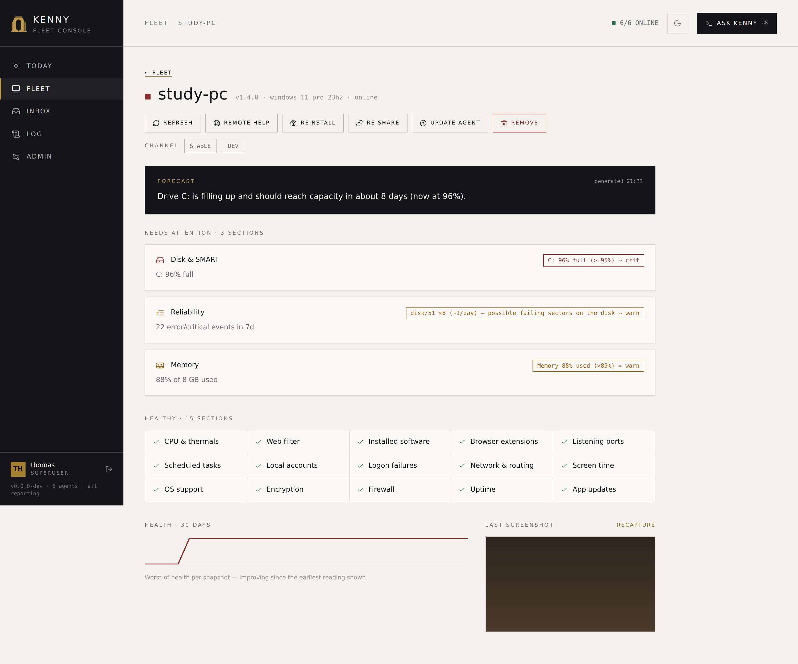

# Telemetry reference

kenny's picture of a PC's health is built from **telemetry**: the agent runs a set of
collectors, packs their results into a JSON snapshot, and pushes it to the server. This
page is the reference for what each section reports, how it is judged, and how long it is
kept. For day-to-day dashboard use see [`user-guide.md`](user-guide.md); for the exact
wire shape see [`protocol.md`](protocol.md).

## How telemetry flows

- The agent runs its collectors and **pushes** one JSON snapshot to the server — by
  default **every 15 minutes** (`KENNY_TELEMETRY_INTERVAL_SECS`, default `900`), plus an
  **immediate first push** right after it connects, so a freshly onboarded PC appears with
  real data at once. The on-demand `telemetry_collect` tool forces a "refresh now".
- The server **persists** every snapshot in SQLite — the latest plus roughly **30 days of
  per-agent history** for the health trend and heatmaps.
- The server evaluates **health rules server-side** ([`health_rules.py`](https://github.com/nullthrone/kenny/blob/main/kenny-server/kenny_server/health_rules.py)).
  These rules are **authoritative** for fleet aggregation: thresholds can change without
  redeploying agents.
- Each section also carries an **agent-set status**. Where a section has a server-side
  rule, **that rule's verdict is the section's status** — the agent-set one is not folded
  in, so a threshold change (or an operator suppression) can relax a section and not only
  tighten it. The agent-set status stands alone for a section with no rule, and for a rule
  that defers because the payload lacks the fields it scores. An agent's **overall health**
  is the worst-of all its sections.

See [ADR-0007](adr/0007-telemetry-push-model-and-sqlite-storage.md) for the push-model and
storage decision.

## Status model

Every section, every agent, and the fleet header use the same four-state model:

| Symbol | Status | Meaning |
|--------|--------|---------|
| Green circle | `ok` | nothing flagged |
| Muted circle | `posture` | a standing configuration fact (e.g. system drive not encrypted, a remote-access port open on purpose, updater services idle) — listed on the host page with its age and once in the weekly digest; never rolls up into a host's overall status and never pushes an alert ([ADR-0058](adr/0058-time-aware-findings-and-incident-posture-split.md)). Server-side only: an agent never sends it |
| Amber ringed circle | `warn` | needs attention (e.g. disk > 80 %, aging battery) |
| Red square | `crit` | acute problem (e.g. Defender real-time protection off, disk ≥ 95 %) |
| Dashed grey | `unknown` / offline | no recent telemetry / agent not connected |

Statuses **roll up by worst-of**. Within a PC, the overall status is the worst section
status; across the fleet, the header shows the worst status of any agent. `crit` beats
`warn` beats `ok`; an offline agent contributes `unknown` rather than a false `ok`. The
roll-up is between *sections*, not between the two opinions about one section — for that,
see the rule precedence above.

## Telemetry sections

The table below lists every section, what it reports, and its server-side health rule (if
any). Sections **without** a dedicated rule defer to the agent-reported status or are
purely informational; several of them still feed the [Today](dashboard.md#today) KPIs and
donut (noted in the rule column).

<figure markdown>

<figcaption>The host page: every telemetry section, surfaced as a problem card when flagged or a checklist entry when healthy, each with its status, summary, and health-rule reason.</figcaption>
</figure>

| Section | Reports | Server-side health rule |
|---------|---------|-------------------------|
| `disk` | Volumes, free space, largest directories | worst volume `percent_used` ≥ 95 → **crit**; > 80 → **warn**; else **ok** |
| `disk_smart` | SMART attributes / drive health flags | *no rule — agent-reported* |
| `defender` | Microsoft Defender state, last scan | `enabled` false **or** `realtime_protection` false → **crit**; last scan older than 14 days → **warn** |
| `defender_quarantine` | Quarantined-threat inventory | *no rule — agent-reported* |
| `av_thirdparty` | Registered third-party antivirus products | *no rule — agent-reported* |
| `firewall` | Windows Firewall profile state | *no rule — feeds the security-posture chart* |
| `encryption` | BitLocker / volume encryption state | system drive (`C:`, else the first volume) `protection_status` ≠ 1 → **posture** (`C: not BitLocker-protected`); no volumes reported → agent status stands. Windows only. Also feeds the security-posture chart |
| `win_update` | Recent Windows Update results | failed rows grouped by KB: a KB that failed ≥ 3 times across ≥ 2 days → **crit** (an update the machine cannot install); any failure → **warn**; `last_check` older than 7 days → **warn**. Reason names the KBs with attempts, first failure and last attempt; per-KB detail travels on `details.failed`. Recurrence is the signal — never the (localized) title, never the row count |
| `app_updates` | Available third-party app updates | *no rule — agent-reported* |
| `reboot_pending` | Pending-reboot flag and reasons | `pending` true → **warn** (reasons joined into the reason string) |
| `os_support` | OS edition/end-of-life date, plus `arch` (`x86_64`/`aarch64`, mirrors `register.meta.arch`, protocol 0.13) and `channel` (`stable`/`dev`, mirrors `register.meta.channel`, protocol 0.17, [ADR-0048](adr/0048-second-release-channel-dev-prereleases.md)) | `eol` true **or** `eol_date` in the past → **crit**; `eol_date` within 90 days → **warn** |
| `memory` | RAM usage | `percent_used` > 95 → **crit**; > 85 → **warn** |
| `thermals` | Temperature sensors | hottest sensor ≥ 95 °C → **crit**; ≥ 85 °C → **warn** |
| `battery` | Battery health and charge (laptops) | `health_percent` < 50 → **crit**; < 70 → **warn**. Laptops only; `battery.present` drives the device (laptop/desktop) pie |
| `reliability` | Grouped Error/Critical event-log breakdown, stability index | Scored on whether each pattern is **still happening** and on **what it is** — never on how many lines it produced. From each group's `by_day`/`last_seen` the rule derives *active* (seen within 48 h, or on ≥ 3 days of the window while still inside it), *recurring* (≥ 2 distinct days) and *burst* (one day holds ≥ 80 % of the count and it has gone quiet). Verdict: a `serious` pattern that is active, **or** `stability_index` < 3 → **crit**; a `serious` pattern that has gone quiet (it self-clears when it leaves the window), a `notable`/`unknown` pattern that is active **and** recurring, **or** `stability_index` < 6 → **warn**; everything else — `benign`, one-off, burst, historical — → **ok**. There is no count threshold: without a classification every pattern is `unknown` and can reach warn but never crit. The reason names up to three scoring patterns (source/event id, count, days active of the window, last seen, suspected cause) and folds the rest into `N historical pattern(s) quiet since <date>`; it never leads with the raw 7-day total. Per-pattern activity travels on the section's `details.patterns`. An operator-suppressed pattern (see *Alarm suppression* below) never scores, but never silences the `stability_index` overlay |
| `web_activity` | Observed domains (parental controls) | a serious flagged hit (`custom` / `seed` / `external_adult`) in 24 h → **crit**; a `bypass` hit in 24 h → **warn** (see [`parental-controls.md`](parental-controls.md)) |
| `listening_ports` | Listening TCP/UDP ports | a non-loopback listener on **22 / 3389 / 5900 / 5985 / 5986** → **posture** (how the machine is set up, not an event; a port that *appears* is a change notification) |
| `local_accounts` | Accounts on the machine (local **and** Microsoft on Windows, `/etc/passwd` on Linux) plus the machine password policy — also the inventory for the `account_*` governance tools, and where each account publishes the verbs it cannot perform | an enabled admin with `password_required` false **and** no password ever set → **crit**; built-in Administrator or Guest enabled → **warn** (Windows only — `root` being enabled on Linux is not a finding); an admin that also carries denied logon rights → **warn** (one of the two settings is stale) (see [`account-governance.md`](account-governance.md)) |
| `logon_failures` | Failed sign-ins per account over 24 h, split by interactive / network / remote (Windows Security log; sshd + PAM failures from the journal on Linux, where `network` does not occur) | ≥ 15 failures against a single account **or** ≥ 15 against usernames that do not exist here → **warn**. Never **crit** — a failed sign-in is not by itself a compromised machine |
| `backup_status` | Restore points, File History, OneDrive | no restore point in 30 days **and** File History not running **and** OneDrive not running → **warn** |
| `net_quality` | Gateway + reference ping probe | reference loss ≥ 60 % → **crit**; gateway latency > 100 ms **or** loss > 20 % → **warn** |
| `installed_software` | Installed programs inventory | *no rule — agent-reported* |
| `browser_extensions` | Browser extensions across profiles | *no rule — agent-reported* |
| `scheduled_tasks` | Non-Microsoft scheduled tasks | *no rule — agent-reported* |
| `services` | Service inventory (Windows: all services; Linux: failed systemd units) | Windows: an auto-start service that is not running → **posture** (on a real PC these are updater and trigger-start services idling by design; a service that *fails* shows up as Service Control Manager events in `reliability`); Linux: a `failed` unit → **warn**; nothing reported → agent status stands |
| `autostart` | Autostart / run-key entries | *no rule — agent-reported* |
| `peripherals` | Connected devices | *no rule — agent-reported* |
| `printers` | Installed printers | always **ok**; the reason names printers in error/offline (a switched-off peripheral is not a finding about the machine) |
| `network` | Adapters and IP configuration | *no rule — agent-reported* |
| `routing` | Routing table | *no rule — agent-reported* |
| `wifi_quality` | Wi-Fi signal / link quality | *no rule — agent-reported* |
| `time_sync` | Clock synchronization state | `offset_secs` beyond ±5 s → **warn**; `synchronized` false → **warn**; no reading (`synchronized`/`offset_secs` null — time service idle or not queryable) → agent status stands, an unknown is not a finding |
| `uptime` | Boot time and uptime | Windows: ≥ 30 days → **posture** (updates apply on reboot); Linux: never a finding |
| `processes` | Running-process summary | *no rule — agent-reported* |
| `screen_time` | Whole-machine interactive minutes per day | *no rule — informational (see below)* |

!!! note "What feeds Today"
    A few informational sections drive [Today](dashboard.md#today)'s KPIs and health donut
    rather than a per-section status: `reboot_pending`, `app_updates`, `win_update`,
    `defender_quarantine`, `os_support`, and the disk-fill forecast all roll up into the
    six KPI numbers, and every section's worst-of status rolls up into the donut.

### Incidents and posture

Every section verdict belongs to a **tier**, computed next to `status` in
`health_rules.evaluate_section` and carried as `tier` on the section: `incident` (`warn`
/ `crit` — time-bound, allowed to alarm), `posture` (a standing fact — listed and aged,
never alarmed on, never rolled up) or `none`. `attention` is true only for incidents. The
five sections that used to carry the agent's own grade (`services`, `encryption`,
`printers`, `time_sync`, `uptime`) now report without grading — the collectors always send
`status: "ok"` — and the rules above are the only judgement, so the server can relax a
section as well as tighten it. A non-ok section also carries `since`/`age_seconds` on
the read paths that have an alert-state store: how long it has held its *current* status,
as recorded by the alert loop (so ages exist only while `KENNY_ALERT_INTERVAL_SECS` > 0).
See [ADR-0058](adr/0058-time-aware-findings-and-incident-posture-split.md).

## Reliability categorization

The `reliability` section reports a **breakdown** of Error/Critical Windows event-log
entries — grouped by `source` + `event_id`, each with a sample message and per-day counts
— rather than a single number. The agent reports what happened and does not grade it: it
always sends `status: "ok"` for this section, and the health rule below is the only
judgement. A push whose event-log probe failed carries no counts at all (only a
`reliability unavailable` summary), so a failed reading is never mistaken for a clean one. To make those groups legible (and to score them
meaningfully, see below), the server sorts each distinct group into one **friendly
category**:

*Disk & storage · App crash / hang · Bluescreen / bugcheck · Driver & hardware · Power &
boot · Windows service · Windows Update · Network · Security · Other.*

— plus a **severity** (`benign` / `notable` / `serious`, or `unknown` when the model is
genuinely unsure) and a short plain-language **suspected cause** for the pattern.

The classification is done by the **connected LLM (Haiku)**, validated against fixed
enums, and **persisted** by `(source, event_id)` in the `event_classifications` table
(ADR-0058), mirrored in memory. A pattern is classified once, in the background, right
after the telemetry push that first carries it lands — ingestion never waits for the
model — and the persisted verdict is stamped onto every snapshot read from then on, on
the same read-path seam as alarm suppression below. So push alerting, the weekly digest,
the fleet list, MCP and the dashboard all score the same severity: one verdict per host.
Category/severity/suspected-cause are server-side annotations; the agent never sends them.
Without an `ANTHROPIC_API_KEY` (or on an API error) a pattern stays unclassified and is
scored as `severity="unknown"` — never as `benign` — and the heatmaps, health scoring, and
expandable raw groups still work. A classifier model upgrade drops the old verdicts at
boot and re-classifies.

This drives both the per-host **category × day** heatmap on
[the host page's Reliability section](dashboard.md#reliability) and the health rule
itself: a pattern's `severity` is what tells "300 repeats of one known-benign timeout"
apart from "300 distinct novel errors", and its activity — derived from the `by_day`
histogram and `last_seen` the agent already sends — is what tells a reboot storm a week
ago apart from a pattern firing every day (see the `reliability` row in the section table
above). A group with `severity="serious"` also flags its heatmap cell **crit**, even when
the agent-reported Windows `level` is plain `"error"`.

See [ADR-0026](adr/0026-llm-categorization-of-reliability-events.md) for the categorization
decision and [ADR-0058](adr/0058-time-aware-findings-and-incident-posture-split.md) for
why the verdicts are persisted and scoring follows activity.

## Alarm suppression

A single, well-known-benign event pattern can dominate a host's reliability scoring — e.g.
the `Microsoft-Windows-CAPI2` / `4176` "AuthSafes count" quirk some Windows builds log
hundreds of times a day from `CryptSvc`, with no known root cause or fix. The operator can
**suppress** a specific `(source, event_id)` pattern from the Reliability section detail:
either a click next to the offending event row (always fleet-wide, exact source), or the
suppression panel's manual form (**event id required, source optional** — an empty source
matches *any* source reporting that event id). A rule is fleet-wide by default; the panel
also offers scoping it to one host.

A suppressed pattern:

- **stays fully visible** with its full raw count, in the raw event table and the category
  × day heatmap — suppression never hides volume;
- **carries a distinct `suppressed` badge**, never the `benign` severity pill — "the model
  classified this as harmless" and "the operator decided to ignore this" are different
  claims, from different sources, and the UI keeps them visually separate;
- is **excluded from severity scoring** — it never counts as a scoring pattern, however
  active it is, and drops out of the health rule's reason string, replaced by a
  `(N pattern(s) suppressed)` note so the reader knows the quiet is explained, not guessed;
- **does not affect the `stability_index` overlay** — the Windows Reliability Index is an
  independent, agent-computed signal a suppression rule carries no information about, so it
  keeps applying on top regardless of what's suppressed.

Suppression is a synchronous, LLM-free rule lookup stamped on the telemetry store's
read path — the same seam the persisted classification above rides — so every health
consumer sees it: push alerting, the weekly digest, the fleet list, and MCP's
`agent_health`/`agent_snapshot` all see the same `suppressed` marker. Rules are managed via `/api/reliability/suppressions`
(operator+ to write) or the `reliability_suppression_list`/`_add`/`_remove` MCP tools. See
[ADR-0041](adr/0041-reliability-alarm-suppression.md).

## Screen time

The `screen_time` section reports **whole-machine interactive minutes per calendar day**
over a 7-day window — for parental awareness of how much a PC was actually in use. It is
deliberately coarse: **day buckets only, and nothing finer**. There are no usernames, no
per-user split, no app names or titles, and no timestamps below the day bucket; the shape
of the payload *cannot* express them.

!!! note "kenny reports, parents judge"
    No health rule judges screen time — a number of hours is neither `warn` nor `crit`. The
    section always carries `status: "ok"` and surfaces as 7-day bars in the drill-down.

See [ADR-0029](adr/0029-screen-time-aggregated-session-minutes.md), and the
[`parental-controls.md`](parental-controls.md) guide.

## Retention & limits

- **Retention:** the server keeps roughly **30 days** of per-agent snapshot history
  (latest + trend); older snapshots auto-prune.
- **Per-push caps:** each snapshot is bounded so a misbehaving collector cannot flood the
  store:

    | Variable | Default | Meaning |
    |----------|---------|---------|
    | `KENNY_MAX_TELEMETRY_BYTES` | `262144` (256 KiB) | maximum encoded size of one push |
    | `KENNY_MAX_TELEMETRY_SECTIONS` | `128` | maximum number of sections per push |

See [`setup.md`](setup.md) for these and other environment variables, and
[`protocol.md`](protocol.md) for the on-the-wire telemetry frame and section shapes.

## See also

- [`user-guide.md`](user-guide.md) — reading the fleet view and drill-down
- [`dashboard.md`](dashboard.md) — the dashboard panels in detail
- [`protocol.md`](protocol.md) — the agent ⇄ server wire contract
- [ADR-0007](adr/0007-telemetry-push-model-and-sqlite-storage.md) — push model & SQLite storage
- [ADR-0026](adr/0026-llm-categorization-of-reliability-events.md) — LLM reliability categorization
- [ADR-0028](adr/0028-security-and-resilience-telemetry-sections.md) — security & resilience sections
- [ADR-0029](adr/0029-screen-time-aggregated-session-minutes.md) — screen-time aggregation
