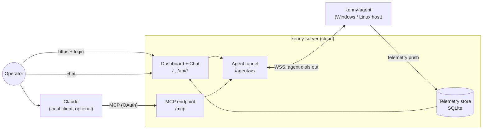
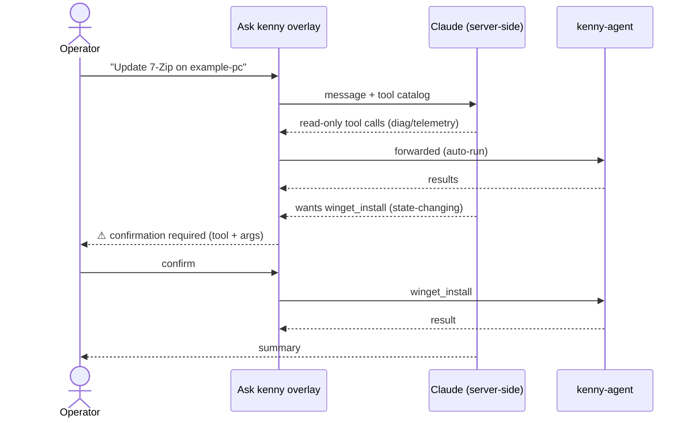
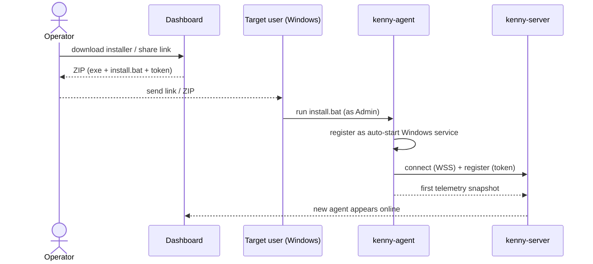
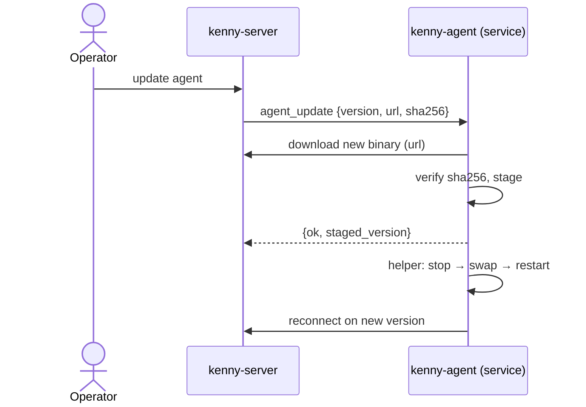

# kenny — User Guide

This guide is for the **operator**: the person who watches the machines in the fleet and runs
commands on them through kenny. For installing and hosting the server, see
[`setup.md`](setup.md).

## What kenny gives you

- A **Today page** — the fleet in one sentence, the items that need attention ranked by
  consequence, a health donut, a 30-day trend, and six fleet KPIs.
- A **Fleet page** — a card per machine, worst-first, and a full **host page** per PC:
  every telemetry section, a health trend, inventory changes + forecasts, and the last
  screenshot.
- Two ways to act on a PC: talk to **Claude** (which calls kenny's tools), either from a
  local Claude client over MCP or from **Ask kenny**, a global overlay you open with ⌘K
  anywhere in the dashboard — no local client needed, with a confirm-gate on anything that
  changes state.
- **Parental controls** (web activity + web filter, screen time) and **push alerts** with a
  weekly digest.
- One-click **agent installer download** (and a shareable link) plus **server-triggered updates**.

!!! tip "Two guides"
    This page is the **task-oriented** walkthrough. For an exhaustive, screenshot-by-screenshot
    tour of **every** tab, widget, and popup, see the **[Dashboard reference](dashboard.md)**.

## The pieces

The agent always **dials out** to the server (NAT/firewall friendly) and authenticates with its
own per-agent token; you authenticate to the server with the **operator token**.

## Signing in

1. Open the server in a browser (e.g. `https://kenny.example.com/`).
2. You are redirected to `/login`. Enter the **operator token** (set by whoever runs the server as
   `KENNY_OPERATOR_TOKEN`). A cookie keeps you signed in; `/logout` clears it.

> The web UI and a local Claude client are two separate front doors to the same account. The
> browser uses this login cookie; Claude Desktop uses the **OAuth flow** (see
> [Option B](#option-b-a-local-claude-client-over-mcp) below), signing in with these same
> credentials and approving the connection once.

## The Today page

The landing view: a plain-English **verdict sentence**, at most **three** items ranked by
consequence (a critical section beats a warning section, which beats a held approval,
which beats a stale ticket) with a link straight to the host or ticket behind each one, a
fleet **health donut**, a **30-day trend**, and **six KPI numbers** (reboots pending,
open/failed updates, quarantine, EOL, disks filling). When nothing needs attention, the
page says so plainly instead of showing an empty chart — "all quiet" is a normal, expected
state, not an error. Full details in the [dashboard reference](dashboard.md#today).

## The Fleet page

Each PC is a card with a status dot:

| Dot | Status | Meaning |
|-----|--------|---------|
| 🟢 | `ok` | nothing flagged |
| 🟡 | `warn` | something needs attention (e.g. disk > 80 %, aging battery) |
| ▫️ | `posture` | on a section only, never on the card: a standing fact about how the PC is set up (drive not encrypted, remote access open, updater services idle). Listed on the host page with its age; never turns a card amber or red, never sends an alert |
| 🔴 | `crit` | acute problem (e.g. Defender real-time protection off, disk ≥ 95 %) |
| ⚪ | `unknown`/offline | no recent telemetry / agent not connected |

The header shows the **online count** for the whole fleet. Click a card to open that PC's
own page.

## The host page

- **Needs attention** — one card per flagged section: the rule reason and a one-line
  summary. Click a card to open its **section modal**, rendered as readable tables and
  fields (no raw JSON). When an Anthropic API key is configured, a **Recommendation**
  (Diagnosis / Action / Urgency) streams in at the top, sometimes with a **Fix via Ask
  kenny** button that opens the [Ask kenny overlay](dashboard.md#ask-kenny), scoped to this
  host, with a fix prompt ready to send. On **Reliability**, a noisy but known-harmless
  Windows event pattern (e.g. a `CryptSvc` quirk repeating hundreds of times a day) can be
  **suppressed** — a click next to the offending row, or the panel's manual form (event id
  required, source optional) — so it stops dominating the health status while its raw
  count stays visible. See [Alarm suppression](telemetry.md#alarm-suppression).
- **Healthy · N sections** — everything not flagged, as a compact checklist; click an
  entry for the same section modal without the recommendation block.
- **Forecast** — a short, plain-English outlook pinned near the top: what is likely to need
  attention on this PC soon, drawn from the disk-fill and battery trends and the inventory
  changes since yesterday. With an Anthropic API key the model writes it; without a key the
  same panel shows a concise deterministic summary.
- **Health trend** — recent snapshots as a sparkline.
- **Last screenshot** — the most recent desktop capture, with a **recapture** button.
- Action buttons: **refresh**, **remote help** (Quick Assist), **reinstall**, **re-share**,
  **update agent**, **remove**. Onboarding a *new* PC uses the **Add a PC** wizard on
  [Fleet](dashboard.md#fleet) (installer / share link); from an existing PC's own page,
  **reinstall** / **re-share** re-provision that PC (rotating its token).

kenny reports around **30 telemetry sections** — disk & SMART, memory, CPU/thermals, uptime,
network & routing, Wi‑Fi, Defender (+ quarantine), third-party AV, firewall, BitLocker, Windows
Update & app updates, reboot-pending, OS support/EOL, services, autostart, scheduled tasks,
peripherals, printers, local accounts, listening ports, backup status, battery, reliability, time
sync, web activity, and screen time. Health thresholds are evaluated **server-side**
(authoritative); the agent also sets a reasonable per-section status. See the
[telemetry reference](telemetry.md) for every section and its rule.

The **fleet-wide observability** lives on the **Log** page: a searchable, server-paged stream
of every tool call (read-only vs state-changing, ok/err), emitted [alerts](alerting.md), and
server/agent log lines, filterable by chip (ALL / TOOLS / ALERTS / EVENTS) or free text. The
**Inbox** — reached from the header's own badge — groups everything that needs a decision by
who it's waiting on, flagged sections included, for fast triage.

## Running commands on a PC

### Option A — Ask kenny (no local client)

Press **⌘K** (Ctrl+K) anywhere in the dashboard, or use the header button, and ask in plain
language (“is Defender on for example-pc?”, “free up disk on example-laptop”). Claude picks
the right kenny tools and runs them. Opening the overlay from a host's own page scopes the
conversation to that host automatically; opening it from anywhere else scopes it to the
whole fleet.

**Confirm-gate:** read-only tools (diagnostics, `fs_read`/`list`/`search`, `telemetry_collect`,
`*_list`, `screen_capture`) run automatically. Anything **state-changing** —
`powershell_exec`, `shell_exec`, `winget_install/uninstall/update`, `net_dns_flush`, `net_adapter_reset`,
`agent_update` — pauses for your explicit confirmation before it runs, and this gate is not
dismissible: there is no "decide later" here, so closing the overlay never reads as a
decision. Every call is recorded in [Log](dashboard.md#log). `powershell_exec` (Windows) and
`shell_exec` (Linux/macOS) are OS-scoped mirrors of each other — kenny refuses the wrong one
for a given PC's OS before it ever runs.

A **scope chip** in the overlay shows whether the chat is scoped to a host or the whole
fleet. Conversations are **saved** — **new** starts a fresh one and **history** browses,
resumes, or deletes past ones. See the [tool reference](tools.md) for the full catalog and
the [dashboard reference](dashboard.md#ask-kenny) for Ask kenny in detail.

### Option B — a local Claude client over MCP

kenny is a remote MCP server with a built-in **OAuth 2.1** authorization flow ([ADR-0037](adr/0037-oauth2-authorization-server-for-mcp.md)),
so connecting Claude Desktop takes no token copy-paste:

1. In Claude Desktop, open **Settings → Connectors → Add custom connector**.
2. Enter the server's MCP URL — `https://<server>/mcp` — and continue.
3. Claude opens kenny's sign-in page. Log in with your kenny **username and password** (and 2FA
   code if you enabled it), the same credentials as the web dashboard.
4. Approve the one-time **"Allow this connection?"** consent screen. Claude stores the resulting
   token and reconnects automatically from then on.

The connection acts as **your** account: the same tools are available, all within your role and
host scope. Every capability call names its own target PC with an `agent_id` argument —
`select_agent` is still there for discovery, but each call must say which host it means (see the
[tool reference](tools.md) for why). Revoke the connection any time by disabling the grant (or
resetting your password) — see the [dashboard reference](dashboard.md).

> **Scripts and other MCP clients** that can't do the OAuth handshake can still authenticate with a
> **personal access token**: mint one under *Profile → personal access tokens* and send it as
> `Authorization: Bearer <pat>` to `https://<server>/mcp`.

### Tool catalog

| Family | Tools | Changes state? |
|--------|-------|----------------|
| Shell | `powershell_exec` (Windows) · `shell_exec` (Linux/macOS) | ✅ |
| Packages | `winget_list` · `winget_install` · `winget_uninstall` · `winget_update` | install/uninstall/update ✅ |
| Files | `fs_list` · `fs_search` · `fs_read` · `fs_disk_usage` | read-only |
| Diagnostics | `diag_processes` · `diag_services` · `diag_eventlog` · `diag_autostart` | read-only |
| Network | `net_config` · `net_dns_flush` · `net_adapter_reset` | dns_flush/adapter_reset ✅ |
| Screen | `screen_capture` | read-only |
| Telemetry | `telemetry_collect` | read-only |
| Agent mgmt | `agent_update` | ✅ |
| Server-only | `list_agents` · `select_agent` · `fleet_overview` · `agent_health` · `agent_snapshot` | read-only |

Parental-controls tools (`webfilter_apply/clear`, `webfilter_get/set/push`, `web_activity_query`)
are covered in **[Parental controls](parental-controls.md)**. The **[tool reference](tools.md)** has
the complete catalog with arguments and the state-changing classification.

### The local kill switch (endpoint user)

The person sitting at a managed PC can switch remote control **off** at any time from
the kenny tray icon (notification area) → **Fernsteuerung aktiv**. While off, the agent
refuses every state-changing tool above (the ✅ rows) and a forwarded call comes back
with `error.code = "disabled"`; **telemetry and all read-only tools keep working**, so
the dashboard stays live. Remote control is **on by default** and the choice persists
across restarts. The tray icon shows the state at a glance (normal Kenny = on, greyed
with a red slash = off). To re-enable, open the menu and toggle it back on. See
[ADR-0011](adr/0011-local-remote-control-kill-switch.md).

## Adding a PC to the fleet

The **Add a PC** wizard, opened from [Fleet](dashboard.md#fleet), walks through three
steps: name the machine, pick its OS, then hand it over. **Download installer** gives you
a ZIP (the agent binary + an `install.bat` pre-filled with the server URL, the agent's id,
and a freshly minted token). Or use **share a one-time link** to send the target user a
single-use, 24-hour-expiring download link they can open without your login. For a PC
that already exists, [its own page](dashboard.md#the-host-page)'s **reinstall** /
**re-share** buttons do the same for that agent id (rotating its token, so the old install
stops reporting).

The installer registers the agent as an **auto-starting Windows service** (restart-on-failure), so
it survives reboots. To remove it: `kenny-agent.exe uninstall`.

## Updating an agent

**update agent** pushes a server-triggered self-update. The agent downloads the new binary from the
server, verifies its SHA-256 **before** swapping, then a helper stops the service, replaces the
binary (with rollback on failure), and restarts it.

## Good habits for operators

- Treat `powershell_exec`/`shell_exec` and the `winget`/`net` write tools as real admin power —
  confirm deliberately. Screenshots and `fs_read` can expose private content; use them sparingly.
- Telemetry summaries come from the agent; the dashboard is for **your own** machines only.
- If a PC shows `crit`, open it and read the section reason before acting.
- Rotate a PC's token (re-download the installer) if you suspect a leaked token.

See [`setup.md`](setup.md) for hosting, TLS, environment variables, and releases.
